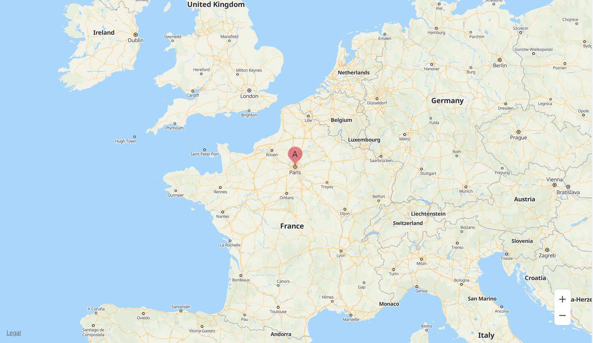
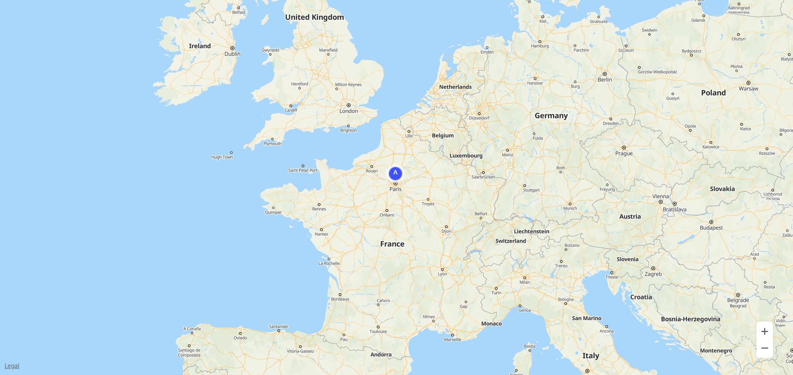

# Marker<a name="EN-US_TOPIC_0000001145723511"></a>

-   [Adding a Marker](#section12463812181214)
-   [Customizing a Marker](#section885013431413)
-   [Removing a Marker](#section14900115661616)
-   [Modifying a Marker](#section632714275188)
-   [Listening for Marker Events](#section105643583181)

You can add markers to a map to identify locations such as stores and buildings, and provide location details with information windows.

## Adding a Marker<a name="section12463812181214"></a>

Use the  **HWMapJsSDK**.[HWMarker](en-us_topic_0000001145843361.md)\([MarkerOptions](en-us_topic_0000001145843361.md#s4804c4d28aaf42d2926e1cb1f7efd2d4)\) method to create a marker on the map. The sample code is as follows:

```
var map;
var mMarker;

// Start the script callback.
function initMap() {
    var mapOptions = {};
    mapOptions.center = {lat: 48.856613, lng: 2.352222};
    mapOptions.zoom = 5;
    
    // Initialize the map.
    map = new HWMapJsSDK.HWMap(document.getElementById('map'), mapOptions);

    // Initialize the marker. 
    mMarker = new HWMapJsSDK.HWMarker({
        map: map,
        position: {lat: 48.85, lng: 2.35},
        zIndex: 10,
        label: {
            text: 'A',
            offsetY: -30,
            fontSize: '20px'
        },
        icon: {
            opacity: 0.5,
            scale: 1.2,
        }
    });
}
```

The sample code is to add a marker whose label is  **A**  and transparency is  **0.5**  at 48.85°N, 2.35°E.  [Figure 1](#fig15876161442011)  shows the added marker.

**Figure  1**  Marker<a name="fig15876161442011"></a>  




For details about custom attributes supported by  **MarkerOptions**, please refer to  [MarkerOptions](en-us_topic_0000001145843361.md#s4804c4d28aaf42d2926e1cb1f7efd2d4).

## Customizing a Marker<a name="section885013431413"></a>

Use a custom icon for the marker. The sample code is as follows:

```
mMarker = new HWMapJsSDK.HWMarker({
    map: map,
    position: {lat: 48.85, lng: 2.35},
    label: {
        text: 'A',
        color: '#ffffff',
    },
    icon: {
        scale: 2,
        url: 'location-marker.png'
    }
});
```

[Figure 2](#fig45411343182118)  shows a custom marker.

**Figure  2**  Custom marker<a name="fig45411343182118"></a>  




## Removing a Marker<a name="section14900115661616"></a>

To remove a marker from a map, call the  **setMap\(\)**  method and pass  **null**  as a parameter of the method.

```
mMarker.setMap(null);
```

Note that the previous method cannot be used to delete a marker. It simply removes the marker from the map. To delete a marker, you need to remove it from the map and set the marker itself to  **null**.

```
mMarker.setMap(null);
mMarker = null;
```

## Modifying a Marker<a name="section632714275188"></a>

Use the methods of the  [HWMarker](en-us_topic_0000001145843361.md)  object to modify marker attributes. The following sample code is to modify the  **position**  attribute of a marker:

```
<tr>
    <td>Marker Lat:</td>
    <td><input id="markerLatInput" type="text" value="48"/></td>
</tr>
<tr>
    <td>Marker Lng:</td>
    <td><input id="markerLngInput" type="text" value="1.5"/></td>
</tr>

var lat = Number(document.getElementById("markerLatInput").value);
var lng = Number(document.getElementById("markerLngInput").value);
mMarker.setPosition({lat: lat, lng: lng});
```

The following table describes marker attributes that can be customized. For details, please refer to  [HWMarker](en-us_topic_0000001145843361.md). 

<a name="table27370548"></a>
<table><thead align="left"><tr id="row20758774"><th class="cellrowborder" valign="top" width="40%" id="mcps1.1.3.1.1"><p id="p3739106"><a name="p3739106"></a><a name="p3739106"></a><strong id="b14281539191018"><a name="b14281539191018"></a><a name="b14281539191018"></a>Attribute</strong></p>
</th>
<th class="cellrowborder" valign="top" width="60%" id="mcps1.1.3.1.2"><p id="p34432195"><a name="p34432195"></a><a name="p34432195"></a><strong id="b18301239101011"><a name="b18301239101011"></a><a name="b18301239101011"></a>Description</strong></p>
</th>
</tr>
</thead>
<tbody><tr id="row39603122"><td class="cellrowborder" valign="top" width="40%" headers="mcps1.1.3.1.1 "><p id="p53736309"><a name="p53736309"></a><a name="p53736309"></a>setIcon(icon)</p>
</td>
<td class="cellrowborder" valign="top" width="60%" headers="mcps1.1.3.1.2 "><p id="p57673781"><a name="p57673781"></a><a name="p57673781"></a>Sets the icon of a marker.</p>
</td>
</tr>
<tr id="row49301983"><td class="cellrowborder" valign="top" width="40%" headers="mcps1.1.3.1.1 "><p id="p34037668"><a name="p34037668"></a><a name="p34037668"></a>setLabel(label)</p>
</td>
<td class="cellrowborder" valign="top" width="60%" headers="mcps1.1.3.1.2 "><p id="p5587738"><a name="p5587738"></a><a name="p5587738"></a>Sets the label of a marker.</p>
</td>
</tr>
<tr id="row50289647"><td class="cellrowborder" valign="top" width="40%" headers="mcps1.1.3.1.1 "><p id="p46929584"><a name="p46929584"></a><a name="p46929584"></a>setPosition(position)</p>
</td>
<td class="cellrowborder" valign="top" width="60%" headers="mcps1.1.3.1.2 "><p id="p43199991"><a name="p43199991"></a><a name="p43199991"></a>Sets the position of a marker.</p>
</td>
</tr>
<tr id="row6109849143010"><td class="cellrowborder" valign="top" width="40%" headers="mcps1.1.3.1.1 "><p id="p191101949123020"><a name="p191101949123020"></a><a name="p191101949123020"></a>setZIndex(zIndex)</p>
</td>
<td class="cellrowborder" valign="top" width="60%" headers="mcps1.1.3.1.2 "><p id="p411034953016"><a name="p411034953016"></a><a name="p411034953016"></a>Sets the Z-index of a marker.</p>
</td>
</tr>
</tbody>
</table>

## Listening for Marker Events<a name="section105643583181"></a>

The following table describes maker events. For details, please refer to  [HWMarker](en-us_topic_0000001145843361.md).

<a name="table45438767"></a>
<table><thead align="left"><tr id="row52187928"><th class="cellrowborder" valign="top" width="40%" id="mcps1.1.3.1.1"><p id="p66472641"><a name="p66472641"></a><a name="p66472641"></a><strong id="b1384074791018"><a name="b1384074791018"></a><a name="b1384074791018"></a>Event</strong></p>
</th>
<th class="cellrowborder" valign="top" width="60%" id="mcps1.1.3.1.2"><p id="p15574875"><a name="p15574875"></a><a name="p15574875"></a><strong id="b14862447171017"><a name="b14862447171017"></a><a name="b14862447171017"></a>Description</strong></p>
</th>
</tr>
</thead>
<tbody><tr id="row5956154"><td class="cellrowborder" valign="top" width="40%" headers="mcps1.1.3.1.1 "><p id="p12686464"><a name="p12686464"></a><a name="p12686464"></a>click</p>
</td>
<td class="cellrowborder" valign="top" width="60%" headers="mcps1.1.3.1.2 "><p id="p20970634"><a name="p20970634"></a><a name="p20970634"></a>Click on a marker.</p>
</td>
</tr>
<tr id="row54517980"><td class="cellrowborder" valign="top" width="40%" headers="mcps1.1.3.1.1 "><p id="p53880264"><a name="p53880264"></a><a name="p53880264"></a>dbclick</p>
</td>
<td class="cellrowborder" valign="top" width="60%" headers="mcps1.1.3.1.2 "><p id="p2225260"><a name="p2225260"></a><a name="p2225260"></a>Double-click on a marker. </p>
</td>
</tr>
<tr id="row20027347"><td class="cellrowborder" valign="top" width="40%" headers="mcps1.1.3.1.1 "><p id="p11602431"><a name="p11602431"></a><a name="p11602431"></a>icon_changed</p>
</td>
<td class="cellrowborder" valign="top" width="60%" headers="mcps1.1.3.1.2 "><p id="p272888"><a name="p272888"></a><a name="p272888"></a>Marker icon change.</p>
</td>
</tr>
<tr id="row2455997"><td class="cellrowborder" valign="top" width="40%" headers="mcps1.1.3.1.1 "><p id="p64718035"><a name="p64718035"></a><a name="p64718035"></a>mousedown</p>
</td>
<td class="cellrowborder" valign="top" width="60%" headers="mcps1.1.3.1.2 "><p id="p7669482"><a name="p7669482"></a><a name="p7669482"></a>Mouse button press.</p>
</td>
</tr>
<tr id="row1916477"><td class="cellrowborder" valign="top" width="40%" headers="mcps1.1.3.1.1 "><p id="p21016952"><a name="p21016952"></a><a name="p21016952"></a>mouseup</p>
</td>
<td class="cellrowborder" valign="top" width="60%" headers="mcps1.1.3.1.2 "><p id="p24651527"><a name="p24651527"></a><a name="p24651527"></a>Mouse button release.</p>
</td>
</tr>
<tr id="row20537154"><td class="cellrowborder" valign="top" width="40%" headers="mcps1.1.3.1.1 "><p id="p52896747"><a name="p52896747"></a><a name="p52896747"></a>position_changed</p>
</td>
<td class="cellrowborder" valign="top" width="60%" headers="mcps1.1.3.1.2 "><p id="p56778076"><a name="p56778076"></a><a name="p56778076"></a>Position change.</p>
</td>
</tr>
</tbody>
</table>

The following sample code is to listen for marker tap events. To set this listener, call the  **addListener\('click', callback\)**  method of the  [HWMarker](en-us_topic_0000001145843361.md)  object.

```
mMarker.addListener('click', () => {
    alert("On Marker Click!");
});
```

