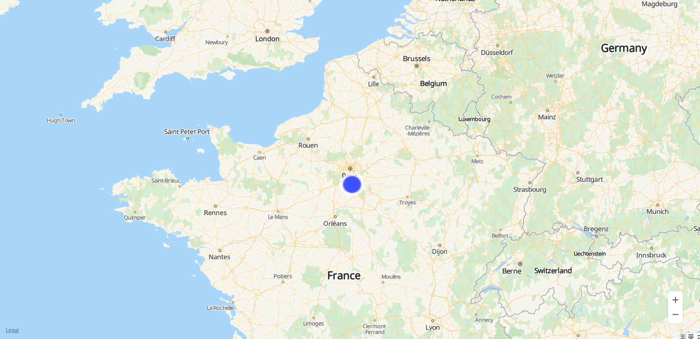

# Ground Overlay<a name="EN-US_TOPIC_0000001099163556"></a>

-   [Adding a Ground Overlay](#section8130729132917)
-   [Removing a Ground Overlay](#section8879241103017)
-   [Modifying a Ground Overlay](#section173661808318)

A ground overlay is an image fixed on a map.

## Adding a Ground Overlay<a name="section8130729132917"></a>

Use the  **HWMapJsSDK**.[HWGroundOverlay](en-us_topic_0000001099003518.md)**\(imageUrl, bounds, groundOverlayOptions\)**  method to create a ground overlay on the map. The sample code is as follows:

```
var map;
var mGroundOverlay;

function initMap() {
    var mapOptions = {};
    mapOptions.center = {lat: 48.856613, lng: 2.352222};
    mapOptions.zoom = 6;

    map = new HWMapJsSDK.HWMap(document.getElementById('map'), mapOptions);

    var imageBounds = {
        north: 48.8,
        south: 48.3,
        east: 2.8,
        west: 2,
    };

    mGroundOverlay = new HWMapJsSDK.HWGroundOverlay(
        // Path to a local image or the URL of an image.
        'covering.png',
        imageBounds,
        {
            map: map,
            opacity: 1,
            zIndex: 1
        }
    );
}
```

[Figure 1](#fig175861416172715)  shows the added ground overlay.

**Figure  1**  Ground overlay<a name="fig175861416172715"></a>  




## Removing a Ground Overlay<a name="section8879241103017"></a>

To remove a ground overlay from a map, call the  **setMap\(\)**  method and pass  **null**  as a parameter of the method.

```
mGroundOverlay.setMap(null);
```

Note that the previous method cannot be used to delete a ground overlay. It simply removes the ground overlay from the map. To delete a ground overlay, you need to remove it from the map and set the ground overlay itself to  **null**.

```
mGroundOverlay.setMap(null);
mGroundOverlay = null;
```

## Modifying a Ground Overlay<a name="section173661808318"></a>

Use the methods of the  [HWGroundOverlay](en-us_topic_0000001099003518.md)  object to modify ground overlay attributes. The following sample code is to modify the URL of a ground overlay:

```
<tr>
    <td>URL:</td>
    <td><input id="urlInput" type="text"
               <!-- Set value to a path to a local image or the URL of an image. -->
               value="huawei_logo.png"/>
    </td>
</tr>
```

```
var url = document.getElementById("urlInput").value;
mGroundOverlay.setUrl(url);
```

The following table describes ground overlay attributes that can be customized. For details, please refer to  [HWGroundOverlay](en-us_topic_0000001099003518.md). 

<a name="table28525097"></a>
<table><thead align="left"><tr id="row20859864"><th class="cellrowborder" valign="top" width="40%" id="mcps1.1.3.1.1"><p id="p11927387"><a name="p11927387"></a><a name="p11927387"></a><strong id="b136606719159"><a name="b136606719159"></a><a name="b136606719159"></a>Attribute</strong></p>
</th>
<th class="cellrowborder" valign="top" width="60%" id="mcps1.1.3.1.2"><p id="p26594328"><a name="p26594328"></a><a name="p26594328"></a><strong id="b176811071156"><a name="b176811071156"></a><a name="b176811071156"></a>Description</strong></p>
</th>
</tr>
</thead>
<tbody><tr id="row38022363"><td class="cellrowborder" valign="top" width="40%" headers="mcps1.1.3.1.1 "><p id="p59912543"><a name="p59912543"></a><a name="p59912543"></a>setBounds(bounds)</p>
</td>
<td class="cellrowborder" valign="top" width="60%" headers="mcps1.1.3.1.2 "><p id="p21077808"><a name="p21077808"></a><a name="p21077808"></a>Sets the bounds of the area for displaying a ground overlay.</p>
</td>
</tr>
<tr id="row55482544"><td class="cellrowborder" valign="top" width="40%" headers="mcps1.1.3.1.1 "><p id="p64901086"><a name="p64901086"></a><a name="p64901086"></a>setOpacity(opacity)</p>
</td>
<td class="cellrowborder" valign="top" width="60%" headers="mcps1.1.3.1.2 "><p id="p22496653"><a name="p22496653"></a><a name="p22496653"></a>Sets the transparency of a ground overlay.</p>
</td>
</tr>
<tr id="row1143293"><td class="cellrowborder" valign="top" width="40%" headers="mcps1.1.3.1.1 "><p id="p25497871"><a name="p25497871"></a><a name="p25497871"></a>setUrl(url)</p>
</td>
<td class="cellrowborder" valign="top" width="60%" headers="mcps1.1.3.1.2 "><p id="p52061686"><a name="p52061686"></a><a name="p52061686"></a>Sets the image URL.</p>
</td>
</tr>
<tr id="row65901997"><td class="cellrowborder" valign="top" width="40%" headers="mcps1.1.3.1.1 "><p id="p36461550"><a name="p36461550"></a><a name="p36461550"></a>setMap(map)</p>
</td>
<td class="cellrowborder" valign="top" width="60%" headers="mcps1.1.3.1.2 "><p id="p595575"><a name="p595575"></a><a name="p595575"></a>Sets a map instance.</p>
</td>
</tr>
</tbody>
</table>

