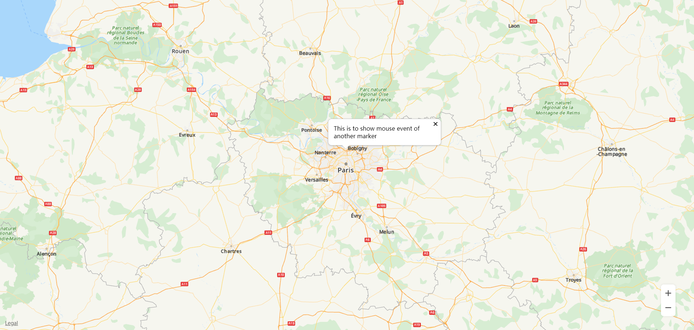
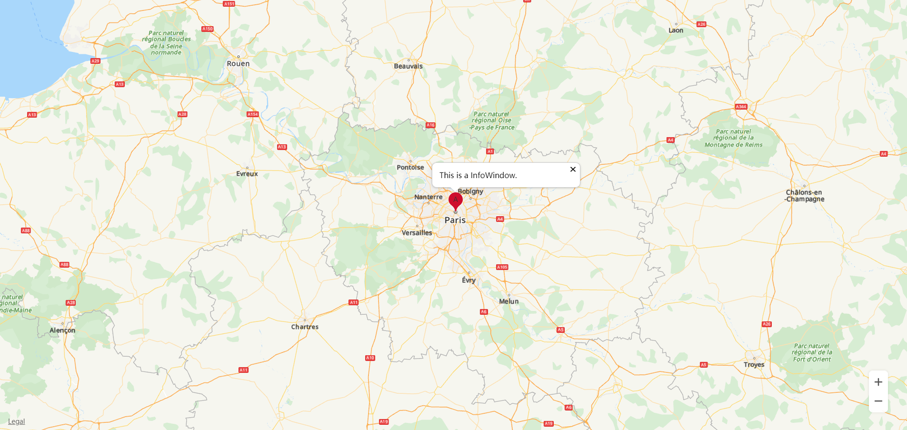

# Information Window<a name="EN-US_TOPIC_0000001145523581"></a>

-   [Creating an Information Window](#section524717617265)
-   [Displaying/Hiding an Information Window](#section966142082619)
-   [Displaying an Information Window on a Marker](#section1710105522616)
-   [Modifying an Information Window](#section17316133011278)
-   [Listening for Information Window Events](#section114051839122814)

The HMS Core Map SDK supports the display of information windows on the map. There are two types of information windows: One is to display text or image independently, and the other is to display text or image in a popup above a marker. The information window provides details about a marker.

## Creating an Information Window<a name="section524717617265"></a>

```
var infoWindow;

function initMap() {
    var mapOptions = {};
    mapOptions.center = {lat: 48.856613, lng: 2.352222};
    mapOptions.zoom = 8;
    var map = new HWMapJsSDK.HWMap(document.getElementById('map'), mapOptions);
    infoWindow = new HWMapJsSDK.HWInfoWindow({
        map,
        position: {lat: 48.856613, lng: 2.352222},
        content: 'This is to show mouse event of another marker',
        offset: [0, -40],
    });
}
```

## Displaying/Hiding an Information Window<a name="section966142082619"></a>

```
// Display an information window.
function openInfoWindowBtnClick() {
    infoWindow.open();
}
// Hide an information window.
function closeInfoWindowBtnClick() {
    infoWindow.close();
}
```

[Figure 1](#fig65608528252)  shows an information window on the map.

**Figure  1**  Information window<a name="fig65608528252"></a>  




## Displaying an Information Window on a Marker<a name="section1710105522616"></a>

```
var mMarker;
var infoWindow;

function initMap() {
    var mapOptions = {};
    mapOptions.center = {lat: 48.856613, lng: 2.352222};
    mapOptions.zoom = 8;

    var map = new HWMapJsSDK.HWMap(document.getElementById('map'), mapOptions);

    // Initialize the marker. 
    mMarker = new HWMapJsSDK.HWMarker({
        map,
        position: {lat: 48.856613, lng: 2.352222},
        label: 'A',
    });

    // Initialize the information window.
    infoWindow = new HWMapJsSDK.HWInfoWindow({
        map,
        position: 10,
        content: 'This is a InfoWindow.',
        offset: [0, -40],
    });
    // Open the information window of marker A.
    infoWindow.open(mMarker);

    // Add a listener to listen for the information window displayed when a marker is tapped.
    mMarker.addListener('click', () => {
        infoWindow.open(mMarker);
    });
}
```

[Figure 2](#fig13454163992613)  shows an information window on a marker on the map.

**Figure  2**  Information window on a marker<a name="fig13454163992613"></a>  




## Modifying an Information Window<a name="section17316133011278"></a>

Use the methods of the  [HWInfoWindow](en-us_topic_0000001145723455.md)  object to modify attributes of an information window. The following sample code is to modify the displayed text of an information window:

```
<tr>
    <td>Content:</td>
    <td><input id="contentInput" type="text" value="This is a new content test..."/></td>
</tr>
<script>
    let content = document.getElementById("contentInput").value;
    infoWindow.setContent(content);

    // Information window closure event.
    infoWindow.addListener('close', () => {
        alert("Info window close...");
    });
</script>
```

The following table describes information window attributes that can be customized. For details, please refer to  [HWInfoWindow](en-us_topic_0000001145723455.md). 

<a name="table39627941"></a>
<table><thead align="left"><tr id="row38468094"><th class="cellrowborder" valign="top" width="40%" id="mcps1.1.3.1.1"><p id="p28907944"><a name="p28907944"></a><a name="p28907944"></a><strong id="b181143814126"><a name="b181143814126"></a><a name="b181143814126"></a>Attribute</strong></p>
</th>
<th class="cellrowborder" valign="top" width="60%" id="mcps1.1.3.1.2"><p id="p59842155"><a name="p59842155"></a><a name="p59842155"></a><strong id="b0211438111219"><a name="b0211438111219"></a><a name="b0211438111219"></a>Description</strong></p>
</th>
</tr>
</thead>
<tbody><tr id="row1708485"><td class="cellrowborder" valign="top" width="40%" headers="mcps1.1.3.1.1 "><p id="p4169567"><a name="p4169567"></a><a name="p4169567"></a>setContent(content)</p>
</td>
<td class="cellrowborder" valign="top" width="60%" headers="mcps1.1.3.1.2 "><p id="p2190629"><a name="p2190629"></a><a name="p2190629"></a>Sets the text displayed in an information window.</p>
</td>
</tr>
<tr id="row19715669"><td class="cellrowborder" valign="top" width="40%" headers="mcps1.1.3.1.1 "><p id="p53465353"><a name="p53465353"></a><a name="p53465353"></a>setPosition(position)</p>
</td>
<td class="cellrowborder" valign="top" width="60%" headers="mcps1.1.3.1.2 "><p id="p35726366"><a name="p35726366"></a><a name="p35726366"></a>Sets the coordinates for displaying an information window.</p>
</td>
</tr>
</tbody>
</table>

## Listening for Information Window Events<a name="section114051839122814"></a>

Set a listener for listening for information window closure events. To set this listener, call the  **addListener\('close', callback\)**  method of the  [HWInfoWindow](en-us_topic_0000001145723455.md)  object.

```
infoWindow.addListener('close', () => {
    alert("Info window close...");
});
```

