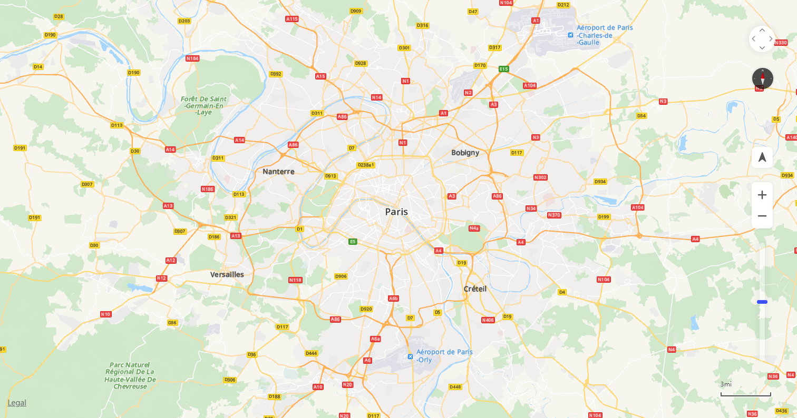

# Map Controls<a name="EN-US_TOPIC_0000001099003590"></a>

-   [Scale](#section988124265618)
-   [Zoom Slider](#section6315812115816)
-   [Zoom Button](#section162650185595)
-   [Compass](#section16392171500)
-   [Pan Button](#section1013965220018)
-   [Copyright](#section3292622119)
-   [My-Location Icon](#section540885012112)

Map controls are used by users to interact with the map. Map Kit provides various UI controls, including the scale, zoom slider, zoom button, compass, pan button, and copyright information, as shown in  [Figure 1](#fig2114301467).

**Figure  1**  Map controls<a name="fig2114301467"></a>  




## Scale<a name="section988124265618"></a>

You can use  **scaleControl**  to specify whether to display the scale and use  **scaleControlOptions**  to set the scale unit. The default value is  **false**, indicating that the scale is not displayed. If the value is  **true**, the scale will be displayed in the lower right corner of the map.

```
var mapOptions = {};
mapOptions.center = {lat: 48.856613, lng: 2.352222};
mapOptions.zoom = 10;
// Set to display the scale.
mapOptions.scaleControl = true; 
mapOptions.scaleControlOptions = {
	// Set the scale unit to inch. 
	units: "imperial" 
};
```

## Zoom Slider<a name="section6315812115816"></a>

You can use  **zoomSlider**  to specify whether to display the zoom slider. The default value is  **false**, indicating that the zoom slider is not displayed. If the value is  **true**, the zoom slider will be displayed in the lower right corner of the map.

```
var mapOptions = {};
mapOptions.center = {lat: 48.856613, lng: 2.352222};
mapOptions.zoom = 10;
// Set that the zoom slider is displayed.
mapOptions.zoomSlider = true;      
```

## Zoom Button<a name="section162650185595"></a>

You can use  **zoomControl**  to specify whether to display the zoom button. The default value is  **true**, indicating that the zoom button will be displayed in the lower right corner of the map. 

```
var mapOptions = {};
mapOptions.center = {lat: 48.856613, lng: 2.352222};
mapOptions.zoom = 10;
// Set that the zoom buttons are not displayed.
mapOptions.zoomControl = false;      
```

## Compass<a name="section16392171500"></a>

You can use  **rotateControl**  to specify whether to display the compass. The default value is  **false**, indicating that the compass is not displayed. If the value is  **true**, the compass will be automatically displayed in the upper right corner when the map does not head north.

```
var mapOptions = {};
mapOptions.center = {lat: 48.856613, lng: 2.352222};
mapOptions.zoom = 10;
// Set that the compass is displayed.
mapOptions.rotateControl= true;      
```

## Pan Button<a name="section1013965220018"></a>

You can use  **navigationControl**  to specify whether to display the pan button. The default value is  **false**, indicating that the pan button is not displayed. If the value is  **true**, the pan button will be displayed in the upper right corner of the map.

```
var mapOptions = {};
mapOptions.center = {lat: 48.856613, lng: 2.352222};
mapOptions.zoom = 10;
// Set that the pan button is displayed. 
mapOptions.navigationControl= true;       
```

## Copyright<a name="section3292622119"></a>

You can use  **copyrightControl**  to specify whether to display the copyright information and use  **copyrightControlOptions**  to customize the copyright information and style. The default value is  **false**, indicating that the copyright information is not displayed.

```
var mapOptions = {};
mapOptions.center = {lat: 48.856613, lng: 2.352222};
mapOptions.zoom = 10;
// Set that the copyright information is displayed.
mapOptions.copyrightControl = true;    
// Set the copyright information.
mapOptions.copyrightControlOptions = {value: "<font style='position: absolute;left:20px;bottom:20px;z-index: 101' size='5' color='red'>HUAWEI</font>",}
```

## My-Location Icon<a name="section540885012112"></a>

You can use  **locationControl**  to specify whether to display the my-location icon. The default value is  **false**, indicating that the my-location icon is not displayed. If the value is  **true**, the my-location icon will be displayed in the lower right corner of the map. \(This control is supported only in HTML5 browsers.\)

```
var mapOptions = {}; 
mapOptions.center = {lat: 48.856613, lng: 2.352222}; 
mapOptions.zoom = 10; 
// Set that the my-location button is displayed.
mapOptions.locationControl= true;       
```

The following table describes whether the my-location control is supported on related browsers and platforms.

<a name="table624mcpsimp"></a>
<table><thead align="left"><tr id="row629mcpsimp"><th class="cellrowborder" valign="top" width="35.38%" id="mcps1.1.4.1.1"><p id="p631mcpsimp"><a name="p631mcpsimp"></a><a name="p631mcpsimp"></a><strong id="b632mcpsimp"><a name="b632mcpsimp"></a><a name="b632mcpsimp"></a>Browser</strong></p>
</th>
<th class="cellrowborder" valign="top" width="26.14%" id="mcps1.1.4.1.2"><p id="p634mcpsimp"><a name="p634mcpsimp"></a><a name="p634mcpsimp"></a><strong id="b635mcpsimp"><a name="b635mcpsimp"></a><a name="b635mcpsimp"></a>Platform</strong></p>
</th>
<th class="cellrowborder" valign="top" width="38.48%" id="mcps1.1.4.1.3"><p id="p91494416136"><a name="p91494416136"></a><a name="p91494416136"></a><strong id="b89061932161911"><a name="b89061932161911"></a><a name="b89061932161911"></a>Support My-Location</strong></p>
</th>
</tr>
</thead>
<tbody><tr id="row637mcpsimp"><td class="cellrowborder" valign="top" width="35.38%" headers="mcps1.1.4.1.1 "><p id="p639mcpsimp"><a name="p639mcpsimp"></a><a name="p639mcpsimp"></a>Chrome 80</p>
</td>
<td class="cellrowborder" valign="top" width="26.14%" headers="mcps1.1.4.1.2 "><p id="p641mcpsimp"><a name="p641mcpsimp"></a><a name="p641mcpsimp"></a>Windows</p>
</td>
<td class="cellrowborder" valign="top" width="38.48%" headers="mcps1.1.4.1.3 "><p id="p1149194131312"><a name="p1149194131312"></a><a name="p1149194131312"></a>Yes</p>
</td>
</tr>
<tr id="row642mcpsimp"><td class="cellrowborder" valign="top" width="35.38%" headers="mcps1.1.4.1.1 "><p id="p644mcpsimp"><a name="p644mcpsimp"></a><a name="p644mcpsimp"></a>Chrome 6x</p>
</td>
<td class="cellrowborder" valign="top" width="26.14%" headers="mcps1.1.4.1.2 "><p id="p646mcpsimp"><a name="p646mcpsimp"></a><a name="p646mcpsimp"></a>Windows</p>
</td>
<td class="cellrowborder" valign="top" width="38.48%" headers="mcps1.1.4.1.3 "><p id="p106451434181316"><a name="p106451434181316"></a><a name="p106451434181316"></a>Yes</p>
</td>
</tr>
<tr id="row647mcpsimp"><td class="cellrowborder" valign="top" width="35.38%" headers="mcps1.1.4.1.1 "><p id="p649mcpsimp"><a name="p649mcpsimp"></a><a name="p649mcpsimp"></a>Chrome 7x</p>
</td>
<td class="cellrowborder" valign="top" width="26.14%" headers="mcps1.1.4.1.2 "><p id="p651mcpsimp"><a name="p651mcpsimp"></a><a name="p651mcpsimp"></a>Windows</p>
</td>
<td class="cellrowborder" valign="top" width="38.48%" headers="mcps1.1.4.1.3 "><p id="p1518716358136"><a name="p1518716358136"></a><a name="p1518716358136"></a>Yes</p>
</td>
</tr>
<tr id="row652mcpsimp"><td class="cellrowborder" valign="top" width="35.38%" headers="mcps1.1.4.1.1 "><p id="p654mcpsimp"><a name="p654mcpsimp"></a><a name="p654mcpsimp"></a>Internet Explorer 10</p>
</td>
<td class="cellrowborder" valign="top" width="26.14%" headers="mcps1.1.4.1.2 "><p id="p656mcpsimp"><a name="p656mcpsimp"></a><a name="p656mcpsimp"></a>Windows</p>
</td>
<td class="cellrowborder" valign="top" width="38.48%" headers="mcps1.1.4.1.3 "><p id="p8149244134"><a name="p8149244134"></a><a name="p8149244134"></a>No</p>
</td>
</tr>
<tr id="row657mcpsimp"><td class="cellrowborder" valign="top" width="35.38%" headers="mcps1.1.4.1.1 "><p id="p659mcpsimp"><a name="p659mcpsimp"></a><a name="p659mcpsimp"></a>Internet Explorer 11</p>
</td>
<td class="cellrowborder" valign="top" width="26.14%" headers="mcps1.1.4.1.2 "><p id="p661mcpsimp"><a name="p661mcpsimp"></a><a name="p661mcpsimp"></a>Windows</p>
</td>
<td class="cellrowborder" valign="top" width="38.48%" headers="mcps1.1.4.1.3 "><p id="p191491446136"><a name="p191491446136"></a><a name="p191491446136"></a>No</p>
</td>
</tr>
<tr id="row11634122564"><td class="cellrowborder" valign="top" width="35.38%" headers="mcps1.1.4.1.1 "><p id="p108087315620"><a name="p108087315620"></a><a name="p108087315620"></a>Chrome 6x</p>
</td>
<td class="cellrowborder" valign="top" width="26.14%" headers="mcps1.1.4.1.2 "><p id="p133443401414"><a name="p133443401414"></a><a name="p133443401414"></a>macOS</p>
</td>
<td class="cellrowborder" valign="top" width="38.48%" headers="mcps1.1.4.1.3 "><p id="p28096315613"><a name="p28096315613"></a><a name="p28096315613"></a>Yes</p>
</td>
</tr>
<tr id="row672mcpsimp"><td class="cellrowborder" valign="top" width="35.38%" headers="mcps1.1.4.1.1 "><p id="p674mcpsimp"><a name="p674mcpsimp"></a><a name="p674mcpsimp"></a>Chrome 7x</p>
</td>
<td class="cellrowborder" valign="top" width="26.14%" headers="mcps1.1.4.1.2 "><p id="p103651246141"><a name="p103651246141"></a><a name="p103651246141"></a>macOS</p>
</td>
<td class="cellrowborder" valign="top" width="38.48%" headers="mcps1.1.4.1.3 "><p id="p141491144138"><a name="p141491144138"></a><a name="p141491144138"></a>Yes</p>
</td>
</tr>
<tr id="row682mcpsimp"><td class="cellrowborder" valign="top" width="35.38%" headers="mcps1.1.4.1.1 "><p id="p684mcpsimp"><a name="p684mcpsimp"></a><a name="p684mcpsimp"></a>Chrome 6x</p>
</td>
<td class="cellrowborder" valign="top" width="26.14%" headers="mcps1.1.4.1.2 "><p id="p686mcpsimp"><a name="p686mcpsimp"></a><a name="p686mcpsimp"></a>Android</p>
</td>
<td class="cellrowborder" valign="top" width="38.48%" headers="mcps1.1.4.1.3 "><p id="p2345122155518"><a name="p2345122155518"></a><a name="p2345122155518"></a>Yes</p>
</td>
</tr>
<tr id="row687mcpsimp"><td class="cellrowborder" valign="top" width="35.38%" headers="mcps1.1.4.1.1 "><p id="p689mcpsimp"><a name="p689mcpsimp"></a><a name="p689mcpsimp"></a>Chrome 7x</p>
</td>
<td class="cellrowborder" valign="top" width="26.14%" headers="mcps1.1.4.1.2 "><p id="p691mcpsimp"><a name="p691mcpsimp"></a><a name="p691mcpsimp"></a>Android</p>
</td>
<td class="cellrowborder" valign="top" width="38.48%" headers="mcps1.1.4.1.3 "><p id="p1619402313552"><a name="p1619402313552"></a><a name="p1619402313552"></a>Yes</p>
</td>
</tr>
<tr id="row692mcpsimp"><td class="cellrowborder" valign="top" width="35.38%" headers="mcps1.1.4.1.1 "><p id="p694mcpsimp"><a name="p694mcpsimp"></a><a name="p694mcpsimp"></a>WeChat V7.X.X (latest version)</p>
</td>
<td class="cellrowborder" valign="top" width="26.14%" headers="mcps1.1.4.1.2 "><p id="p696mcpsimp"><a name="p696mcpsimp"></a><a name="p696mcpsimp"></a>Android</p>
</td>
<td class="cellrowborder" valign="top" width="38.48%" headers="mcps1.1.4.1.3 "><p id="p1150144130"><a name="p1150144130"></a><a name="p1150144130"></a>Yes</p>
</td>
</tr>
<tr id="row697mcpsimp"><td class="cellrowborder" valign="top" width="35.38%" headers="mcps1.1.4.1.1 "><p id="p699mcpsimp"><a name="p699mcpsimp"></a><a name="p699mcpsimp"></a>Huawei Browser (EMUI 9.X)</p>
</td>
<td class="cellrowborder" valign="top" width="26.14%" headers="mcps1.1.4.1.2 "><p id="p701mcpsimp"><a name="p701mcpsimp"></a><a name="p701mcpsimp"></a>Android</p>
</td>
<td class="cellrowborder" valign="top" width="38.48%" headers="mcps1.1.4.1.3 "><p id="p31501949133"><a name="p31501949133"></a><a name="p31501949133"></a>Yes</p>
</td>
</tr>
<tr id="row702mcpsimp"><td class="cellrowborder" valign="top" width="35.38%" headers="mcps1.1.4.1.1 "><p id="p704mcpsimp"><a name="p704mcpsimp"></a><a name="p704mcpsimp"></a>Huawei Browser (EMUI 10.X)</p>
</td>
<td class="cellrowborder" valign="top" width="26.14%" headers="mcps1.1.4.1.2 "><p id="p706mcpsimp"><a name="p706mcpsimp"></a><a name="p706mcpsimp"></a>Android</p>
</td>
<td class="cellrowborder" valign="top" width="38.48%" headers="mcps1.1.4.1.3 "><p id="p11501043132"><a name="p11501043132"></a><a name="p11501043132"></a>Partially supported </p>
</td>
</tr>
<tr id="row707mcpsimp"><td class="cellrowborder" valign="top" width="35.38%" headers="mcps1.1.4.1.1 "><p id="p709mcpsimp"><a name="p709mcpsimp"></a><a name="p709mcpsimp"></a>Safari 12.x</p>
</td>
<td class="cellrowborder" valign="top" width="26.14%" headers="mcps1.1.4.1.2 "><p id="p711mcpsimp"><a name="p711mcpsimp"></a><a name="p711mcpsimp"></a>iOS</p>
</td>
<td class="cellrowborder" valign="top" width="38.48%" headers="mcps1.1.4.1.3 "><p id="p1815014420137"><a name="p1815014420137"></a><a name="p1815014420137"></a>Partially supported </p>
</td>
</tr>
<tr id="row712mcpsimp"><td class="cellrowborder" valign="top" width="35.38%" headers="mcps1.1.4.1.1 "><p id="p714mcpsimp"><a name="p714mcpsimp"></a><a name="p714mcpsimp"></a>Safari 13.x</p>
</td>
<td class="cellrowborder" valign="top" width="26.14%" headers="mcps1.1.4.1.2 "><p id="p716mcpsimp"><a name="p716mcpsimp"></a><a name="p716mcpsimp"></a>iOS</p>
</td>
<td class="cellrowborder" valign="top" width="38.48%" headers="mcps1.1.4.1.3 "><p id="p0150124181314"><a name="p0150124181314"></a><a name="p0150124181314"></a>Yes</p>
</td>
</tr>
<tr id="row717mcpsimp"><td class="cellrowborder" valign="top" width="35.38%" headers="mcps1.1.4.1.1 "><p id="p719mcpsimp"><a name="p719mcpsimp"></a><a name="p719mcpsimp"></a>Safari 13.x</p>
</td>
<td class="cellrowborder" valign="top" width="26.14%" headers="mcps1.1.4.1.2 "><p id="p721mcpsimp"><a name="p721mcpsimp"></a><a name="p721mcpsimp"></a>macOS</p>
</td>
<td class="cellrowborder" valign="top" width="38.48%" headers="mcps1.1.4.1.3 "><p id="p1728516861412"><a name="p1728516861412"></a><a name="p1728516861412"></a>Yes</p>
</td>
</tr>
</tbody>
</table>

> **NOTE:** 
>You can set map controls before creating a map, or use the  **set**  method to set map controls after creating a map.

