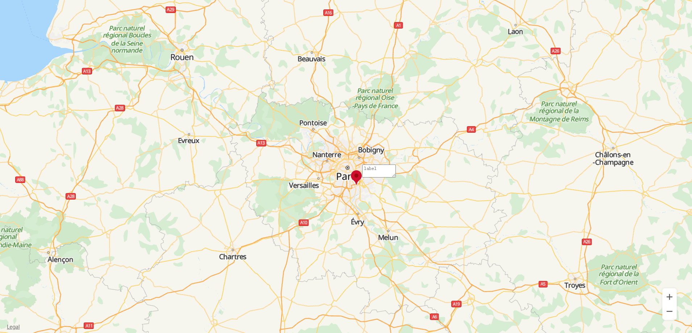
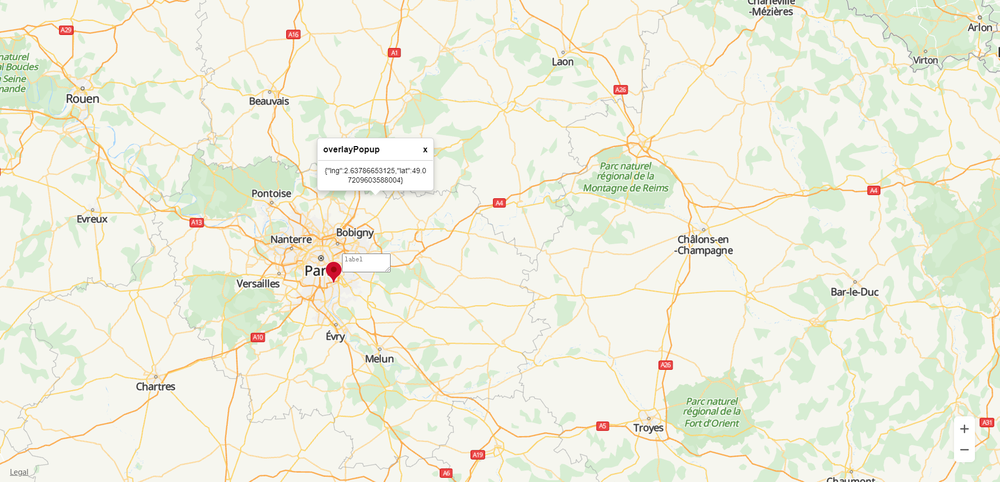

# Customizing an Overlay <a name="EN-US_TOPIC_0000001099003574"></a>

-   [Adding a Custom Image Overlay and a Text Box Overlay](#section137581141202511)
-   [Adding a Custom Popup Overlay](#section187711733193317)
-   [Deleting a Custom Overlay](#section56318683810)
-   [Setting a Custom Overlay](#section10440105104014)

You can add a custom overlay on the map.

## Adding a Custom Image Overlay and a Text Box Overlay<a name="section137581141202511"></a>

You can use the  **HWMapJsSDK.**[HWOverlay](en-us_topic_0000001098683702.md)**\(overlayOptions\)**  method to create a custom image overlay and a text box overlay, and add them on the map. The sample code is as follows:

```
html,
body {
    margin: 0;
    padding: 0;
    height: 100%;
    width: 100%;
}
#map {
    height: 100%;
    width: 100%;
    margin: 0 auto;
}
#marker {
    background: url('./marker-with-dot.png');
    user-select: none;
    width: 48px;
    height: 48px;
}
#label {
    padding: 2px;
    text-indent: 2px;
}
#popup {
    position: absolute;
    opacity: 0;
    max-width: 276px;
    padding: 1;
    font: 400 14px Arial, Helvetica, sans-serif;
    line-height: 1.3;
    background-color: #fff;
    border: 1px solid rgba(0, 0, 0, .2);
    border-radius: 6px;
    box-shadow: 0 5px 10px rgba(0, 0, 0, .2);
}
#popup::after {
    width: 0;
    height: 0;
    content: '';
    display: block;
    border: 10px solid transparent;
    border-top-color: #fff;
    position: absolute;
    left: calc(50% - 10px);
}
.popover_title {
    border-bottom: 1px solid rgba(0, 0, 0, .2);
    padding: 10px;
    margin: 0;
}
.close {
    float: right;
    user-select: none;
    cursor: pointer;
}
.popup_content {
    padding: 10px;
    word-wrap: break-word;
    max-width: 200px;
    text-align: center;
}
<div id="map">
        <div id="popup">
            <h3 class="popover_title">overlayPopup
                <span class="close">x</span>
            </h3>
            <div class="popup_content"></div>
        </div>
</div>
```

```
var map, overlayPopup; 
var popup = document.querySelector('#popup')
var popup_content = popup.querySelector('.popup_content')
var popup_close = popup.querySelector('.close')

function initMap() {
    var mapOptions = {};
    mapOptions.center = {lat: 48.856613, lng: 2.352222};
    mapOptions.zoom = 8;
    map = new HWMapJsSDK.HWMap(document.getElementById('map'), mapOptions);

    // Initialize the HWOverlay marker image.
    overlayMarker = new HWMapJsSDK.HWOverlay({
        map: map,
        content: '<div id="marker"></div>',
        stopEvent: true,
        position: map.getCenter()
    });

    // Initialize HWOverlay.
    overlayLabel = new HWMapJsSDK.HWOverlay({
        map: map,
        offset: [40, -10],
        stopEvent: true,
        position: map.getCenter()
    });

    // Set the overlay (textarea text box).
    overlayLabel.setContent('<textarea id="label" placeholder="label" cols="10" rows="2"></textarea>')
}
```

The sample code adds a custom image overlay and a text box overlay at longitude-latitude \(48.85, 2.35\), as shown in  [Figure 1](#fig8206165243113).

**Figure  1**  Custom image and text box overlays<a name="fig8206165243113"></a>  


## Adding a Custom Popup Overlay<a name="section187711733193317"></a>

Create a custom popup overlay, and add it on the map. The sample code is as follows:

```
// Initialize the HWOverlay popup.
overlayPopup = new HWMapJsSDK.HWOverlay({
    map: map,
    content: popup,
    stopEvent: false
});
 
// Set that the overlay does not support penetration.
overlayPopup. setStopEvent(true)
 
// Listen for map tap events, and bind the map instance.
map.on('click', function (e) {
    overlayPopup.setMap(map)
    const coordinate = HWMapJsSDK.HWMapUtils.epsgToLatLng(e.coordinate);
    Popup.setText(JSON.stringify(coordinate))
    // Set the position of the popup overlay. 
    overlayPopup.setPosition(coordinate)
})
 
// Unbind the map instance.
popup_close.onclick = function () {
    overlayPopup.setMap(null)
}
 
// Build the popup method.
class Popup {
    static async setText(text) {
        popup.style.opacity = 1
        popup_content.innerText = await text
        Popup.setStyle()
    }
    static async setStyle() {
        popup.style.left = (-popup.offsetWidth / 2) + 'px'
        popup.style.top = (-popup.offsetHeight - 10) + 'px'
    }
 }
```

The sample code adds a custom popup overlay on the map, as shown in  [Figure 2](#fig2787370360).

**Figure  2**  Popup overlay<a name="fig2787370360"></a>  


## Deleting a Custom Overlay<a name="section56318683810"></a>

To remove a custom overlay from a map, call the  **setMap\(\)**  method and pass  **null**  as a parameter of the method.

```
// Unbind the map instance.
popup_close.onclick = function () {
    overlayPopup.setMap(null)
}
```

## Setting a Custom Overlay<a name="section10440105104014"></a>

You can use methods of the  [HWOverlay](en-us_topic_0000001098683702.md)  object to set attributes for a custom overlay. The following sample code uses the  **setContent**  method to set the overlay content:

```
// Set the overlay content.
overlayLabel.setContent('<textarea id="label" placeholder="label" cols="10" rows="2"></textarea>')
```

The following table describes overlay attributes that can be customized. For details, please refer to  [HWOverlay](en-us_topic_0000001098683702.md). 

<a name="table83562271411"></a>
<table><thead align="left"><tr id="row3356142734112"><th class="cellrowborder" valign="top" width="40%" id="mcps1.1.3.1.1"><p id="p1356127194113"><a name="p1356127194113"></a><a name="p1356127194113"></a>Attribute</p>
</th>
<th class="cellrowborder" valign="top" width="60%" id="mcps1.1.3.1.2"><p id="p13561427104115"><a name="p13561427104115"></a><a name="p13561427104115"></a>Description</p>
</th>
</tr>
</thead>
<tbody><tr id="row23563277413"><td class="cellrowborder" valign="top" width="40%" headers="mcps1.1.3.1.1 "><p id="p17329751144119"><a name="p17329751144119"></a><a name="p17329751144119"></a>setContent(content)</p>
</td>
<td class="cellrowborder" valign="top" width="60%" headers="mcps1.1.3.1.2 "><p id="p1032985110413"><a name="p1032985110413"></a><a name="p1032985110413"></a>Sets the content of a <a href="en-us_topic_0000001098683702.md">HWOverlay</a> object.</p>
</td>
</tr>
<tr id="row183564279415"><td class="cellrowborder" valign="top" width="40%" headers="mcps1.1.3.1.1 "><p id="p143291651144120"><a name="p143291651144120"></a><a name="p143291651144120"></a>setMap(map)</p>
</td>
<td class="cellrowborder" valign="top" width="60%" headers="mcps1.1.3.1.2 "><p id="p93299510417"><a name="p93299510417"></a><a name="p93299510417"></a>Sets the map to which an overlay is bound.</p>
</td>
</tr>
<tr id="row235612724119"><td class="cellrowborder" valign="top" width="40%" headers="mcps1.1.3.1.1 "><p id="p83291351114111"><a name="p83291351114111"></a><a name="p83291351114111"></a>setPosition(latLng)</p>
</td>
<td class="cellrowborder" valign="top" width="60%" headers="mcps1.1.3.1.2 "><p id="p3329145114417"><a name="p3329145114417"></a><a name="p3329145114417"></a>Sets the position of a <a href="en-us_topic_0000001098683702.md">HWOverlay</a> object.</p>
</td>
</tr>
<tr id="row10356527174117"><td class="cellrowborder" valign="top" width="40%" headers="mcps1.1.3.1.1 "><p id="p103291551164117"><a name="p103291551164117"></a><a name="p103291551164117"></a>setStopEvent(boolean)</p>
</td>
<td class="cellrowborder" valign="top" width="60%" headers="mcps1.1.3.1.2 "><p id="p193294518410"><a name="p193294518410"></a><a name="p193294518410"></a>Sets whether an overlay supports penetration.</p>
</td>
</tr>
</tbody>
</table>

