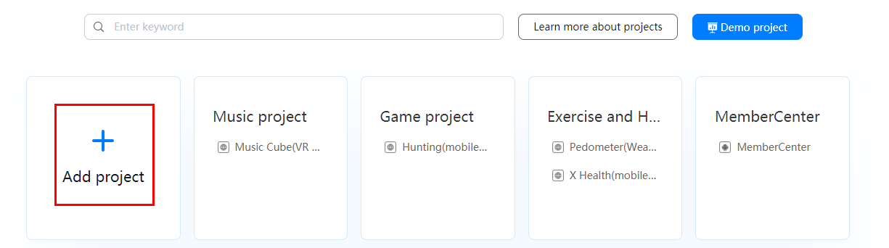
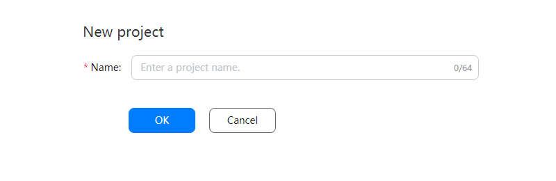
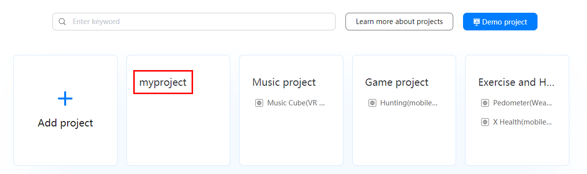
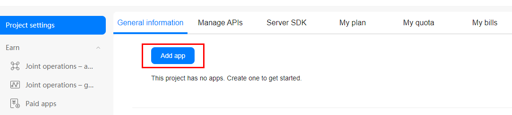
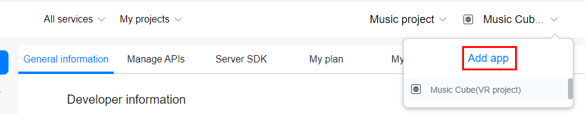
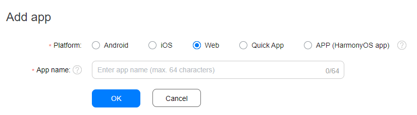
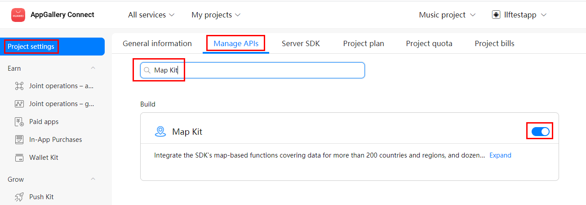

# Preparations

-   [Registering as a Developer](#section47264296)
-   [Creating a Project](#section92411038172816)
-   [Creating an App](#section7940182616297)
-   [Enabling Required Services](#section470311311307)
-   [Obtaining the API Key](#section175508543353)

## Registering as a Developer

Before you get started, you must register as a Huawei developer and complete identity verification on  [HUAWEI Developers](https://developer.huawei.com/consumer/en). For details, please refer to  [Registration and Verification](https://developer.huawei.com/consumer/en/doc/start/registration-and-verification-0000001053628148).

## Creating a Project

A project is a container of your apps in AppGallery Connect. You can add different platform versions of an app to the same project. Before creating an app, create a project in AppGallery Connect first.

1.  Sign in to  [AppGallery Connect](https://developer.huawei.com/consumer/en/service/josp/agc/index.html)  and click  **My projects**.
2.  Click  **Add project**.

    

3.  Enter a project name and click  **OK**.

    

4.  View the created project.

    After the project is created, the  **Project settings**  page is displayed. You need to add an app to the project.

## Creating an App

Before you use development capabilities provided by AppGallery Connect, you need to add an app to your project first.

1.  Sign in to  [AppGallery Connect](https://developer.huawei.com/consumer/en/service/josp/agc/index.html)  and select  **My projects**.
2.  Click your project from the project list.

    

3.  Go to  **Project settings**  \>  **General information**, and click  **Add app**.

    

    If an app already exists in the project, and you need to add a new one, expand the app selection area on the top of the page and click  **Add app**.

    

4.  On the  **Add app**  page, enter app information, and click  **OK**.

    

    
    <table><thead align="left"><tr id="en-us_topic_0000001099163560_row9131193213579"><th class="cellrowborder" valign="top" width="29.299999999999997%" id="mcps1.1.3.1.1">
Parameter

    </th>
    <th class="cellrowborder" valign="top" width="70.7%" id="mcps1.1.3.1.2">
Description

    </th>
    </tr>
    </thead>
    <tbody><tr id="en-us_topic_0000001099163560_row5131153275713"><td class="cellrowborder" valign="top" width="29.299999999999997%" headers="mcps1.1.3.1.1 ">
Platform

    </td>
    <td class="cellrowborder" valign="top" width="70.7%" headers="mcps1.1.3.1.2 ">
App platform. Select <b>Web</b>.

    </td>
    </tr>
    <tr id="en-us_topic_0000001099163560_row813114329579"><td class="cellrowborder" valign="top" width="29.299999999999997%" headers="mcps1.1.3.1.1 ">
App name

    </td>
    <td class="cellrowborder" valign="top" width="70.7%" headers="mcps1.1.3.1.2 ">
Name of the new app, which consists of 1 to 64 characters. After the app is created, a new app ID is generated and the app name can be changed in the app information.

    </td>
    </tr>
    </tbody>
    </table>

## Enabling Required Services

To use Map Kit in your app, you first need to enable the service in  [AppGallery Connect](https://developer.huawei.com/consumer/en/service/josp/agc/index.html).

1.  Sign in to  [AppGallery Connect](https://developer.huawei.com/consumer/en/service/josp/agc/index.html)  and click  **My projects**.
2.  Find your project from the project list and click the app for which you need to enable Map Kit on the project card.
3.  Go to  **Project settings**  \>  **Manage APIs**  and enable Map Kit.

    

## Obtaining the API Key

Before using the service, obtain the API key from  [AppGallery Connect](https://developer.huawei.com/consumer/en/service/josp/agc/index.html). The procedure is as follows:

1.  Sign in to  [AppGallery Connect](https://developer.huawei.com/consumer/en/service/josp/agc/index.html)  and click  **My projects**.
2.  Find your app project, and click the app name.
3.  Go to  **Project settings**  \>  **General information**. In the  **App information**  area, click the    icon next to  **API key**. The API key will then be copied to the clipboard.

    .png)

> **NOTE:** 
>You need to call the  **URLEncoder.encode\("Your apiKey", "UTF-8"\)**  method to encode the API key using  **encodeURI**. For example, if the original API key is  **ABC/DFG+**, the conversion result is  **ABC%2FDFG%2B**.

