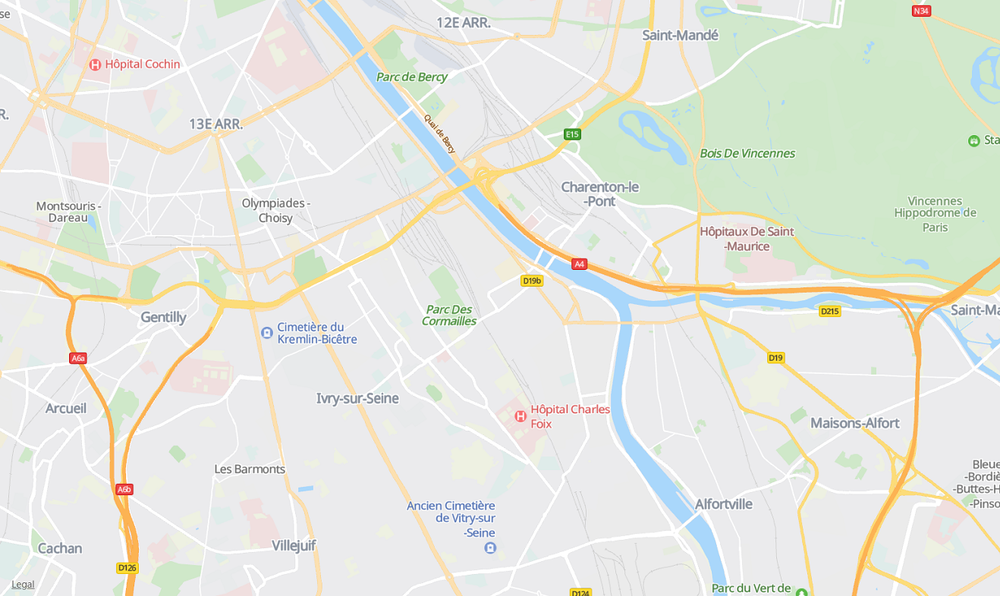
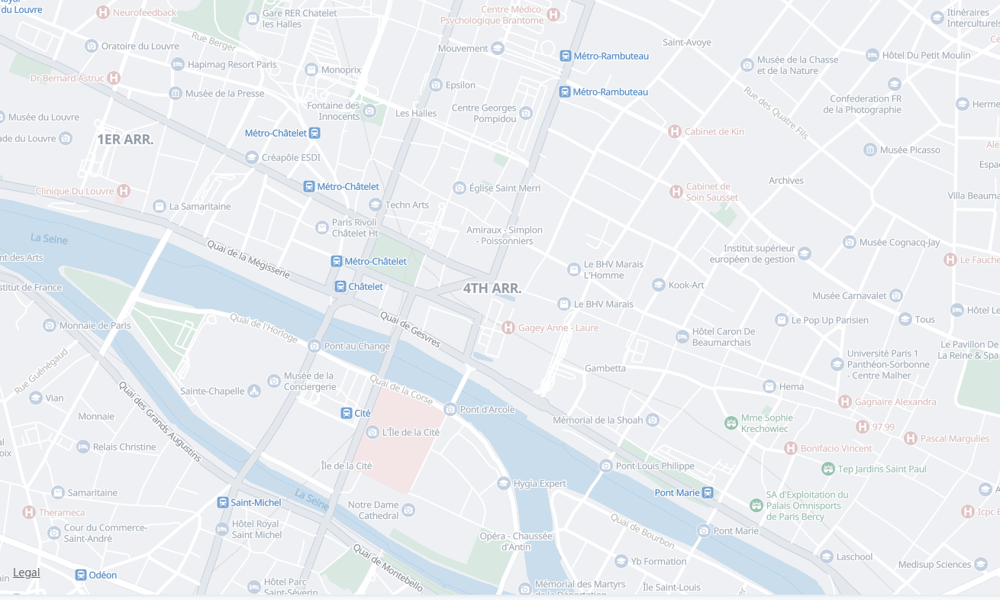
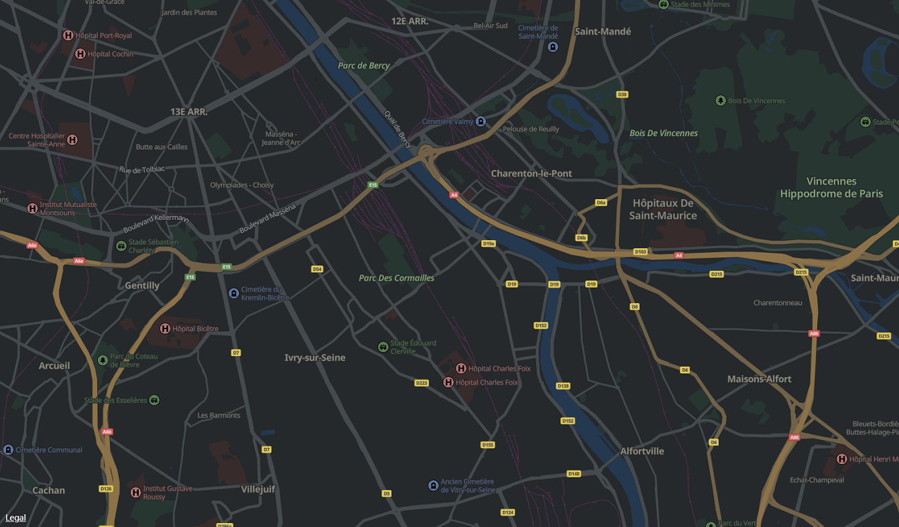
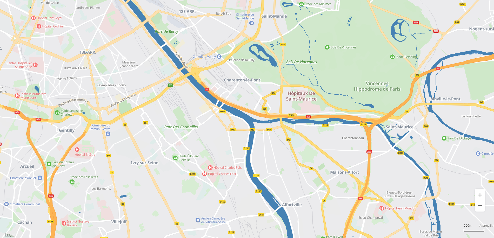

# Procedure<a name="EN-US_TOPIC_0000001145523593"></a>

-   [Using a Preset Style](#section165192093619)
-   [Customizing the Map Style](#section39537541272)
    -   [Setting the Style File](#section375285583717)


## Using a Preset Style<a name="section165192093619"></a>

Call the  **map.setPresetStyleId\(String\)**  method to use a preset style. Currently, the options include  **standard**  \([Figure 1](#fig1014714236435)\),  **simple**  \([Figure 2](#fig874210434435)\), and  **night**  \([Figure 3](#fig177924591437)\). 

```
map.setPresetStyleId("night");
```

<a name="table1271721783219"></a>
<table><tbody><tr id="row1671816174327"><td class="row-nocellborder" style="border:none" valign="top" width="33.33333333333333%"><div class="fignone" id="fig1014714236435"><a name="fig1014714236435"></a><a name="fig1014714236435"></a><span class="figcap"><b>Figure 1 </b>Standard style</span></div>
<p id="p13112194412354"><a name="p13112194412354"></a><a name="p13112194412354"></a><a name="image17112174463517"></a><a name="image17112174463517"></a><span></span></p>
</td>
<td class="row-nocellborder" style="border:none" valign="top" width="33.33333333333333%"><div class="fignone" id="fig874210434435"><a name="fig874210434435"></a><a name="fig874210434435"></a><span class="figcap"><b>Figure 2 </b>Simple style</span></div>
<p id="p19961322143620"><a name="p19961322143620"></a><a name="p19961322143620"></a><a name="image69961022133611"></a><a name="image69961022133611"></a><span></span></p>
</td>
<td class="cellrowborder" style="border:none" valign="top" width="33.33333333333333%"><div class="fignone" id="fig177924591437"><a name="fig177924591437"></a><a name="fig177924591437"></a><span class="figcap"><b>Figure 3 </b>Night style</span></div>
<p id="p06566102378"><a name="p06566102378"></a><a name="p06566102378"></a><a name="image26561410193717"></a><a name="image26561410193717"></a><span></span></p>
</td>
</tr>
</tbody>
</table>

## Customizing the Map Style<a name="section39537541272"></a>

You can customize the map style using the following methods:

-   Setting the style file: Modify the embedded map style file \(JSON file\) to customize the map style.


### Setting the Style File<a name="section375285583717"></a>

Call the  **map.setStyle\(json\)**  method to set a custom map style. The style file is in JSON format. For details, please refer to  [Style Reference](javascript-api-style-reference.md).  [Figure 4](#fig109500164446)  shows the custom map style implemented using a JSON file.

```
map.setStyle([
  {
   "mapFeature": "landcover.natural",
   "options": "geometry.fill",
   "paint": {
    "color": "#8FBC8F"
   }
  },
  {
   "mapFeature": "water",
   "options": "geometry.fill",
   "paint": {
    "color": "#4682B4"
   }
  }
 ]
);
```

**Figure  4**  Custom map style<a name="fig109500164446"></a>  




