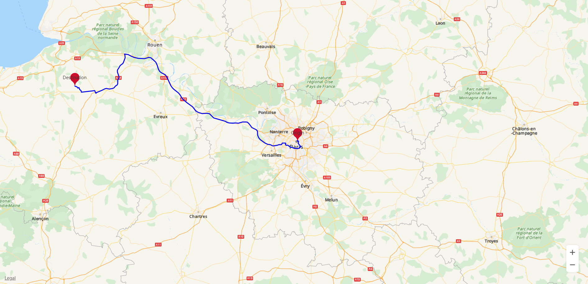

# Sample Code<a name="EN-US_TOPIC_0000001099003584"></a>

```
    var map; 
    var directionsService; 
    var directionsRenderer; 
    var makerOrigin, makerDestination; 
    // Create a route planning request.
    var DirectionsRequest = {}; 
    DirectionsRequest.origin = { 
        lat: 48.86, 
        lng: 2.36 
    }; 
    DirectionsRequest.destination = { 
        lat: 49.18, 
        lng: 0.39 
    }; 
 
    function initMap() { 
        directionsService = new HWMapJsSDK.HWDirectionsService(); 
        directionsRenderer = new HWMapJsSDK.HWDirectionsRenderer(); 
 
        var mapOptions = {}; 
        mapOptions.center = {lat: 48.856613, lng: 2.352222}; 
        mapOptions.zoom = 8; 
        mapOptions.language = 'ENG'; 
 
        map = new HWMapJsSDK.HWMap(document.getElementById('map'), mapOptions); 
 
        makerOrigin = new HWMapJsSDK.HWMarker({ 
            position: DirectionsRequest.origin, 
            label: 'Origin' 
        }); 
 
        makerDestination = new HWMapJsSDK.HWMarker({ 
            position: DirectionsRequest.destination, 
            label: 'Destination' 
        }); 
 
        makerOrigin.setMap(map); 
        makerDestination.setMap(map); 
        // Call the route planning API.
        directionsService.routeDriving(DirectionsRequest, callback); 
        directionsRenderer.setMap(map); 
        // Obtain the route planning result through the callback function.
        function callback(DirectionsResult, DirectionsStatus) { 
            if (DirectionsStatus == '0') { 
                // Render the planned routes through the HWDirectionsRenderer object.
                directionsRenderer.setDirections(DirectionsResult); 
            } 
        } 
    }
```

[Figure 1](#fig19773162144319)  shows the route planning result.

**Figure  1**  Route planning result<a name="fig19773162144319"></a>  




