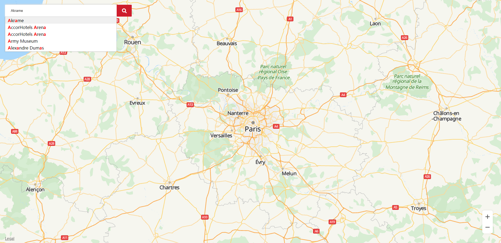

# Search Widget<a name="EN-US_TOPIC_0000001145923551"></a>

-   [Procedure](#section1370143573915)
-   [Sample Code](#section161291227104018)

The JavaScript API of HUAWEI Map Kit provides an autocomplete widget, which automatically completes an address during user input. 

## Procedure<a name="section1370143573915"></a>

1.  Create the HTML element  **input**, which is a search box for users to enter keywords.
2.  Create the search box parameter object  **acOptions**. For details about supported parameters, please refer to  [AutocompleteOptions](en-us_topic_0000001098843510.md#saa4fb00052304977abb1e612fe52f664). \(Only the  **query**  parameter value is entered in the search box.\)
3.  Create a  [HWAutocomplete](en-us_topic_0000001098843510.md)  object through  **HWMapJsSDK**, and pass the created HTML element  **input**  and search box parameter object  **acOptions**. 
4.  Set a listener for the created  [HWAutocomplete](en-us_topic_0000001098843510.md)  object. The search box displays 5 suggested places each time when a user enters a character. After the user taps a suggested place, the listener will be triggered to obtain information about the place. 

## Sample Code<a name="section161291227104018"></a>

```
<style>
        html,
        body {
            margin: 0;
            padding: 0;
            height: 100%;
            width: 100%;
        }

        #map {
            height: 100%;
            width: 100%;
            margin: 0 auto;
        }

        strong {
            color: red;
        }

        .container {
            position: absolute;
            left: 20px;
            top: 20px;
        }

        #searchPosition {
            width: 423px;
            height: 45px;
            box-sizing: border-box;
            outline: none;
            border: 0;
            text-indent: 20px;
            border-radius: 2px;
            box-shadow: 0px -2px 5px rgb(219, 218, 218);
        }

        .iconfont_search {
            background: url('./assets/sprite.png') no-repeat 0 -72px #ce1d2c;
            background-size: cover;
            width: 57px;
            height: 45px;
            border-radius: 2px;
            cursor: pointer;
            position: absolute;
            right: -57px;
            top: 0;
        }
</style>
								
<body>
    <div id="map"></div>
    <div class="container">
            <input type="text" placeholder="Anything you want!" id="searchPosition">
            <div id="iconfont_search" class="iconfont_search"></div>
    </div>
    <script>
        function initMap() {
            var mapOptions = {};
            mapOptions.center = {lat: 48.856613, lng: 2.352222};
            mapOptions.zoom = 8;
            var searchBoxInput = document.getElementById('searchPosition');
            var iconfont_search = document.getElementById('iconfont_search');
            var map = new HWMapJsSDK.HWMap(document.getElementById('map'), mapOptions);
            // Create the search box parameter.
            var acOptions = {
                location: {
                    lat: 48.856613,
                    lng: 2.352222
                },
                radius: 10000,
                customHandler: callback
            };
            var autocomplete;
            // Obtain the input element.
            // Create the HWAutocomplete object and set a listener.
            autocomplete = new HWMapJsSDK.HWAutocomplete(searchBoxInput, acOptions);
            autocomplete.addListener('site_changed', printSites);

            // Process the search result. 
            // index: index of a searched place.
            // data: details of a searched place. 
            // name: search keyword, which is in strong tags. 
            function callback(index, data, name) {
                console.log(index, data, name);
                var div
                div = document.createElement('div');
                div.innerHTML = name;
                return div;
            }

            // Listener.
            function printSites() {
                console.log("in print sites...");
                var site = autocomplete.getSite();
                var results = "Autocomplete Results:\n";
                var str = "Name=" + site.name + "\n"
                    + "SiteID=" + site.siteId + "\n"
                    + "Latitude=" + site.location.lat + "\n"
                    + "Longitude=" + site.location.lng + "\n"
                    + "Address=" + site.formatAddress + "\n";
                results = results + str;
            }

            iconfont_search.onclick = function () {
                console.log('Processing logic'); 
            }
        }
    </script>
</body>
```

[Figure 1](#fig66751444112810)  shows the autocomplete effect.

**Figure  1**  Autocomplete effect<a name="fig66751444112810"></a>  


