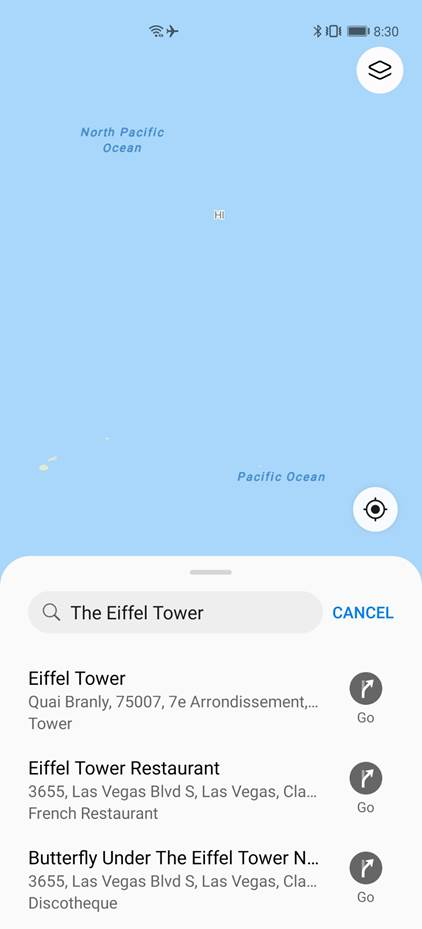

# Keyword Search<a name="EN-US_TOPIC_0000001098843586"></a>

This function returns a list of places based on keywords entered by the user.

-   Deep link example

    ```
    petalmaps://textSearch?text=xxx
    mapapp://textSearch?text=xxx
    ```


-   App link example

    ```
    https://www.petalmaps.com/?q=xxx&utm_source=fb
    ```

-   Parameters

    <a name="table1090724503720"></a>
    <table><thead align="left"><tr id="row1490734519378"><th class="cellrowborder" valign="top" width="20%" id="mcps1.1.5.1.1"><p id="p2090744523719"><a name="p2090744523719"></a><a name="p2090744523719"></a>Parameter</p>
    </th>
    <th class="cellrowborder" valign="top" width="15%" id="mcps1.1.5.1.2"><p id="p15907144593713"><a name="p15907144593713"></a><a name="p15907144593713"></a>Mandatory</p>
    </th>
    <th class="cellrowborder" valign="top" width="15%" id="mcps1.1.5.1.3"><p id="p18907164553714"><a name="p18907164553714"></a><a name="p18907164553714"></a>Type</p>
    </th>
    <th class="cellrowborder" valign="top" width="50%" id="mcps1.1.5.1.4"><p id="p14907114553715"><a name="p14907114553715"></a><a name="p14907114553715"></a>Description</p>
    </th>
    </tr>
    </thead>
    <tbody><tr id="row139081145183718"><td class="cellrowborder" valign="top" width="20%" headers="mcps1.1.5.1.1 "><p id="p125mcpsimp"><a name="p125mcpsimp"></a><a name="p125mcpsimp"></a>text</p>
    </td>
    <td class="cellrowborder" valign="top" width="15%" headers="mcps1.1.5.1.2 "><p id="p1134241864114"><a name="p1134241864114"></a><a name="p1134241864114"></a>Yes</p>
    </td>
    <td class="cellrowborder" valign="top" width="15%" headers="mcps1.1.5.1.3 "><p id="p127mcpsimp"><a name="p127mcpsimp"></a><a name="p127mcpsimp"></a>String</p>
    </td>
    <td class="cellrowborder" valign="top" width="50%" headers="mcps1.1.5.1.4 "><p id="p856614018498"><a name="p856614018498"></a><a name="p856614018498"></a>Search keyword (deep link mode). Either <strong id="b1789316520566"><a name="b1789316520566"></a><a name="b1789316520566"></a>text</strong> or <strong id="b1819048175613"><a name="b1819048175613"></a><a name="b1819048175613"></a>q</strong> needs to be set.</p>
    </td>
    </tr>
    <tr id="row1937114451249"><td class="cellrowborder" valign="top" width="20%" headers="mcps1.1.5.1.1 "><p id="p5372145152418"><a name="p5372145152418"></a><a name="p5372145152418"></a>q</p>
    </td>
    <td class="cellrowborder" valign="top" width="15%" headers="mcps1.1.5.1.2 "><p id="p7372345192418"><a name="p7372345192418"></a><a name="p7372345192418"></a>Yes</p>
    </td>
    <td class="cellrowborder" valign="top" width="15%" headers="mcps1.1.5.1.3 "><p id="p17494174714273"><a name="p17494174714273"></a><a name="p17494174714273"></a>String</p>
    </td>
    <td class="cellrowborder" valign="top" width="50%" headers="mcps1.1.5.1.4 "><p id="p537284517243"><a name="p537284517243"></a><a name="p537284517243"></a>Search keyword (app link mode). Either <strong id="b87500255193"><a name="b87500255193"></a><a name="b87500255193"></a>text</strong> or <strong id="b17755162521912"><a name="b17755162521912"></a><a name="b17755162521912"></a>q</strong> needs to be set.</p>
    </td>
    </tr>
    <tr id="row20243149182618"><td class="cellrowborder" valign="top" width="20%" headers="mcps1.1.5.1.1 "><p id="p5416152215172"><a name="p5416152215172"></a><a name="p5416152215172"></a>utm_source</p>
    </td>
    <td class="cellrowborder" valign="top" width="15%" headers="mcps1.1.5.1.2 "><p id="p11416112217171"><a name="p11416112217171"></a><a name="p11416112217171"></a>No</p>
    </td>
    <td class="cellrowborder" valign="top" width="15%" headers="mcps1.1.5.1.3 "><p id="p174161322131710"><a name="p174161322131710"></a><a name="p174161322131710"></a>String</p>
    </td>
    <td class="cellrowborder" valign="top" width="50%" headers="mcps1.1.5.1.4 "><p id="p1884707181818"><a name="p1884707181818"></a><a name="p1884707181818"></a>Channel source. (For an app, the app package name or app name can be passed.)</p>
    </td>
    </tr>
    <tr id="row18230141712717"><td class="cellrowborder" valign="top" width="20%" headers="mcps1.1.5.1.1 "><p id="p1079613193187"><a name="p1079613193187"></a><a name="p1079613193187"></a>utm_medium</p>
    </td>
    <td class="cellrowborder" valign="top" width="15%" headers="mcps1.1.5.1.2 "><p id="p295410466206"><a name="p295410466206"></a><a name="p295410466206"></a>No</p>
    </td>
    <td class="cellrowborder" valign="top" width="15%" headers="mcps1.1.5.1.3 "><p id="p87968195185"><a name="p87968195185"></a><a name="p87968195185"></a>String</p>
    </td>
    <td class="cellrowborder" valign="top" width="50%" headers="mcps1.1.5.1.4 "><p id="p179641917180"><a name="p179641917180"></a><a name="p179641917180"></a>Media.</p>
    </td>
    </tr>
    <tr id="row16530181922711"><td class="cellrowborder" valign="top" width="20%" headers="mcps1.1.5.1.1 "><p id="p3790421101819"><a name="p3790421101819"></a><a name="p3790421101819"></a>utm_campaign</p>
    </td>
    <td class="cellrowborder" valign="top" width="15%" headers="mcps1.1.5.1.2 "><p id="p199621547172016"><a name="p199621547172016"></a><a name="p199621547172016"></a>No</p>
    </td>
    <td class="cellrowborder" valign="top" width="15%" headers="mcps1.1.5.1.3 "><p id="p12791021131813"><a name="p12791021131813"></a><a name="p12791021131813"></a>String</p>
    </td>
    <td class="cellrowborder" valign="top" width="50%" headers="mcps1.1.5.1.4 "><p id="p197917216189"><a name="p197917216189"></a><a name="p197917216189"></a>Campaign name.</p>
    </td>
    </tr>
    <tr id="row114332262714"><td class="cellrowborder" valign="top" width="20%" headers="mcps1.1.5.1.1 "><p id="p12143122415186"><a name="p12143122415186"></a><a name="p12143122415186"></a>utm_term</p>
    </td>
    <td class="cellrowborder" valign="top" width="15%" headers="mcps1.1.5.1.2 "><p id="p162581249122012"><a name="p162581249122012"></a><a name="p162581249122012"></a>No</p>
    </td>
    <td class="cellrowborder" valign="top" width="15%" headers="mcps1.1.5.1.3 "><p id="p171439243189"><a name="p171439243189"></a><a name="p171439243189"></a>String</p>
    </td>
    <td class="cellrowborder" valign="top" width="50%" headers="mcps1.1.5.1.4 "><p id="p214362491810"><a name="p214362491810"></a><a name="p214362491810"></a>Campaign keyword.</p>
    </td>
    </tr>
    <tr id="row1742415245273"><td class="cellrowborder" valign="top" width="20%" headers="mcps1.1.5.1.1 "><p id="p923533412020"><a name="p923533412020"></a><a name="p923533412020"></a>utm_content</p>
    </td>
    <td class="cellrowborder" valign="top" width="15%" headers="mcps1.1.5.1.2 "><p id="p20306050102018"><a name="p20306050102018"></a><a name="p20306050102018"></a>No</p>
    </td>
    <td class="cellrowborder" valign="top" width="15%" headers="mcps1.1.5.1.3 "><p id="p13235123419206"><a name="p13235123419206"></a><a name="p13235123419206"></a>String</p>
    </td>
    <td class="cellrowborder" valign="top" width="50%" headers="mcps1.1.5.1.4 "><p id="p16235143419201"><a name="p16235143419201"></a><a name="p16235143419201"></a>Campaign content.</p>
    </td>
    </tr>
    </tbody>
    </table>


-   Sample code

    Intent mode:

    ```
    Uri intentUri = Uri.parse("petalmaps://textSearch?text=xxxtxt&utm_source=fb");
    String uriString = "mapapp://textSearch?text=" + "The Eiffel Tower"; 
    Uri content_url = Uri.parse(uriString); 
    Intent intent = new Intent(Intent.ACTION_VIEW, content_url); 
    if (intent.resolveActivity(getPackageManager()) != null) {
         startActivity(intent); 
    }
    ```

    Link mode:

    ```
    https://www.petalmaps.com/routes/?saddr=home&daddr=company&type=drive&utm_source=fb
    ```

    The effect is as follows.

    


