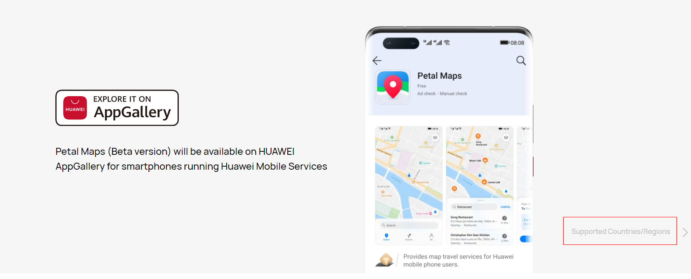

# Service Introduction<a name="EN-US_TOPIC_0000001145723493"></a>

-   [Supported Devices](#section20817330133210)
-   [Supported Countries/Regions](#section1661131753417)
-   [Instructions](#section2295129185117)

Map Kit provides APIs for you to call the Petal Maps app in certain service scenarios. You only need to construct a standard URI based on the API specifications to call the Petal Maps app in your app, allowing your app to provide users with functions including nearby place search, keyword search, route planning, and navigation. 

## Supported Devices<a name="section20817330133210"></a>

<a name="table342mcpsimp"></a>
<table><thead align="left"><tr id="row348mcpsimp"><th class="cellrowborder" valign="top" width="33.33333333333333%" id="mcps1.1.4.1.1"><p id="p352mcpsimp"><a name="p352mcpsimp"></a><a name="p352mcpsimp"></a>Device Type</p>
</th>
<th class="cellrowborder" valign="top" width="33.33333333333333%" id="mcps1.1.4.1.2"><p id="p1530104611285"><a name="p1530104611285"></a><a name="p1530104611285"></a>OS Version</p>
</th>
<th class="cellrowborder" valign="top" width="33.33333333333333%" id="mcps1.1.4.1.3"><p id="p85974818232"><a name="p85974818232"></a><a name="p85974818232"></a>HMS Core (APK) Version</p>
</th>
</tr>
</thead>
<tbody><tr id="row356mcpsimp"><td class="cellrowborder" valign="top" width="33.33333333333333%" headers="mcps1.1.4.1.1 "><p id="p358mcpsimp"><a name="p358mcpsimp"></a><a name="p358mcpsimp"></a>Huawei phones (RAM &gt; 3 GB)</p>
</td>
<td class="cellrowborder" valign="top" width="33.33333333333333%" headers="mcps1.1.4.1.2 "><p id="p17530346192814"><a name="p17530346192814"></a><a name="p17530346192814"></a>EMUI 10.0 or later</p>
</td>
<td class="cellrowborder" valign="top" width="33.33333333333333%" headers="mcps1.1.4.1.3 "><p id="p1959548172317"><a name="p1959548172317"></a><a name="p1959548172317"></a>5.0 or later</p>
</td>
</tr>
</tbody>
</table>

## Supported Countries/Regions<a name="section1661131753417"></a>

For details, click  [here](https://consumer.huawei.com/en/mobileservices/petalmaps/)  and then  **Supported Countries/Regions**  on the page displayed.



## Instructions<a name="section2295129185117"></a>

1.  Create an intent, set it to  **ACTION\_VIEW**, and set the URI of the Petal Maps API. Then, start Petal Maps using the  **startActivity\(\)**  method.

    Sample code \(for keyword search\):

    ```
    // Initialize the URI string for keyword search.
    String uriString = "petalmaps://textSearch?text=" + "The Eiffel Tower";
    String uriString = "mapapp://textSearch?text=" + "The Eiffel Tower";
    // Create a URI based on the URI string.
    Uri content_url = Uri.parse(uriString);
    // Create an intent and set it to ACTION_VIEW.
    Intent intent = new Intent(Intent.ACTION_VIEW, content_url);
    // Start Petal Maps using the startActivity() method.
    startActivity(intent);
    ```

2.  Add the  **resolveActivity\(\)**  method to check whether the intent is empty before starting Petal Maps. If the Petal Maps app for responding to the intent is not installed on the device, your app may crash when calling the Petal Maps API. Therefore, the  **startActivity\(\)**  method is executed only when the intent is not empty.

    Sample code:

    ```
    // Initialize the URI string for keyword search.
    String uriString = "petalmaps://textSearch?text=" + "The Eiffel Tower";
    String uriString = "mapapp://textSearch?text=" + "The Eiffel Tower";
    // Create a URI based on the URI string.
    Uri content_url = Uri.parse(uriString);
    // Declare and initialize an intent instance.
    Intent intent = new Intent(Intent.ACTION_VIEW, content_url);
    // Check whether an activity can start this intent.
    if(intent.resolveActivity(getPackageManager()) != null) {
    	startActivity(intent);
    }
    ```


