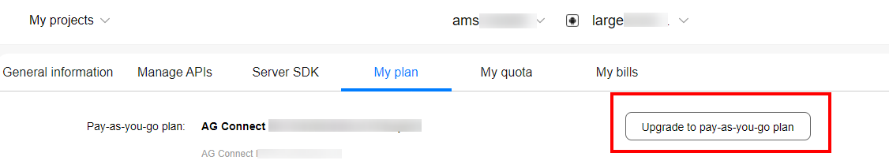

# Getting Started

-   [Development Process](#section1789025332016)
-   [Subscribing to a Pay-As-You-Go Plan](#section12268164318111)

## Development Process

Follow the steps in the following process when you develop an app.

<table><thead align="left"><tr id="row15305163112618"><th class="cellrowborder" align="center" valign="top" width="6.28062806280628%" id="mcps1.1.4.1.1">
No.

</th>
<th class="cellrowborder" valign="top" width="29.282928292829286%" id="mcps1.1.4.1.2">
Step

</th>
<th class="cellrowborder" valign="top" width="64.43644364436445%" id="mcps1.1.4.1.3">
Description

</th>
</tr>
</thead>
<tbody><tr id="row528171163512"><td class="cellrowborder" align="center" valign="top" width="6.28062806280628%" headers="mcps1.1.4.1.1 ">
1

</td>
<td class="cellrowborder" valign="top" width="29.282928292829286%" headers="mcps1.1.4.1.2 ">
<a href="web-api-preparations.md">Preparations</a>

</td>
<td class="cellrowborder" valign="top" width="64.43644364436445%" headers="mcps1.1.4.1.3 ">
Make preparations for developing your app, including <a href="web-api-preparations.md#section47264296">Registering as a Developer</a>, <a href="web-api-preparations.md#section196902382910">Creating a Project</a>, <a href="web-api-preparations.md#section294363472920">Creating an App</a>, <a href="web-api-preparations.md#section2119133716579">Enabling Required Services</a>, and <a href="web-api-preparations.md#section169441820428">Obtaining the API Key</a>. 

If you have created an app in <a href="https://developer.huawei.com/consumer/en/service/josp/agc/index.html" target="_blank" rel="noopener noreferrer">AppGallery Connect</a>, directly obtain an API key by referring to <a href="web-api-preparations.md#section169441820428">Obtaining the API Key</a> to use the service. 

</td>
</tr>
<tr id="row552823953512"><td class="cellrowborder" align="center" valign="top" width="6.28062806280628%" headers="mcps1.1.4.1.1 ">
2

</td>
<td class="cellrowborder" valign="top" width="29.282928292829286%" headers="mcps1.1.4.1.2 ">
<a href="#section12268164318111">Subscribing to a Pay-As-You-Go Plan</a>

</td>
<td class="cellrowborder" valign="top" width="64.43644364436445%" headers="mcps1.1.4.1.3 ">
Subscribe to a pay-as-you-go plan. You can change the plan anytime.

</td>
</tr>
<tr id="row215818418196"><td class="cellrowborder" rowspan="4" align="center" valign="top" width="6.28062806280628%" headers="mcps1.1.4.1.1 ">
3

</td>
<td class="cellrowborder" valign="top" width="29.282928292829286%" headers="mcps1.1.4.1.2 ">
<a href="web-diretions-api-introduction.md">Directions API</a>

</td>
<td class="cellrowborder" valign="top" width="64.43644364436445%" headers="mcps1.1.4.1.3 ">
Call APIs for planning walking, cycling, and driving routes, as well as calculating distances of planned routes.

</td>
</tr>
<tr id="row14808202071911"><td class="cellrowborder" valign="top" headers="mcps1.1.4.1.1 ">
<a href="web-matrix-api-introduction.md">Matrix API</a>

</td>
<td class="cellrowborder" valign="top" headers="mcps1.1.4.1.2 ">
Call APIs for calculating the distances and journey time of routes between multiple departure places and destinations. The APIs also support walking, cycling, and driving routes. 

</td>
</tr>
<tr id="row1913928104216"><td class="cellrowborder" valign="top" headers="mcps1.1.4.1.1 ">
<a href="web-static-map-introduction.md">Maps Static API</a>

</td>
<td class="cellrowborder" valign="top" headers="mcps1.1.4.1.2 ">
Call APIs for embedding a map image into your web page.

</td>
</tr>
<tr id="row1561593020428"><td class="cellrowborder" valign="top" headers="mcps1.1.4.1.1 ">
<a href="web-tile-api-introduction.md">Tile API</a>

</td>
<td class="cellrowborder" valign="top" headers="mcps1.1.4.1.2 ">
Call APIs for directly accessing and obtaining Huawei map tiles to construct a map layer.

</td>
</tr>
</tbody>
</table>

## Subscribing to a Pay-As-You-Go Plan

From January 1, 2021, Map Kit will offer pay-as-you-go plans for some of its APIs. For details, please refer to  [Service Pricing](about-charging.md). To upgrade the pay-as-you-go plan for your project, sign in to  [AppGallery Connect](https://developer.huawei.com/consumer/en/service/josp/agc/index.html), click  **My projects**, click your project, and go to  **Project settings**  \>  **My plan**.

