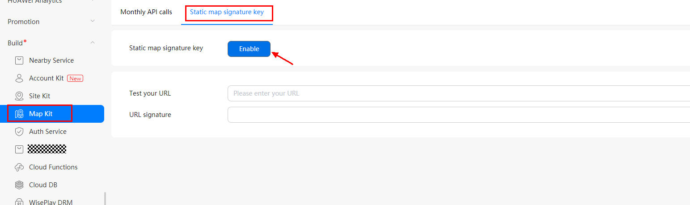
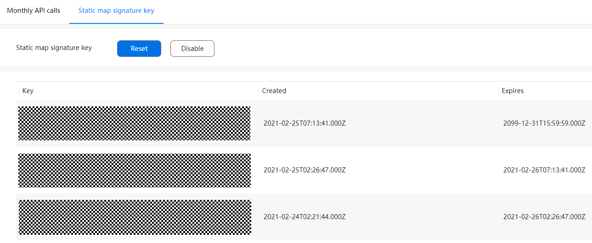

# Maps Static API

-   [Static Map Signature](#section934413612518)
    -   [Obtaining the Signature Key](#section91071644142315)

The Maps Static API embeds a map image into your web page. For details, please refer to  [Maps Static APIs](en-us_topic_0000001145923483.md).

When using the Maps Static API, you are advised to enable the static map signature function and use HTTP requests carrying a signature, further ensuring API security.

## Static Map Signature

In addition to the API key, you also need to verify requests using a signature to further ensure security of the Maps Static API.

The static map signature function uses the signature key generated in  [AppGallery Connect](https://developer.huawei.com/consumer/en/service/josp/agc/index.html)  to encrypt the URL to obtain a signature, and uses URL requests constructed using the signature and API key to ensure API security.

### Obtaining the Signature Key

Before using the static map signature function, sign in to  [AppGallery Connect](https://developer.huawei.com/consumer/en/service/josp/agc/index.html)  and obtain the signature key. The procedure is as follows:

1.  Sign in to  [AppGallery Connect](https://developer.huawei.com/consumer/en/service/josp/agc/index.html)  and click  **My projects**.
2.  Find your app project, and click the app name.
3.  Go to  **Build**  \>  **Map Kit**, click  **Static map signature key**, and click  **Enable**.

    

4.  Obtain the signature key. To ensure API security, keep the signature key secure.

    

