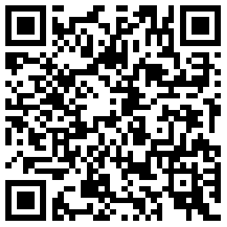
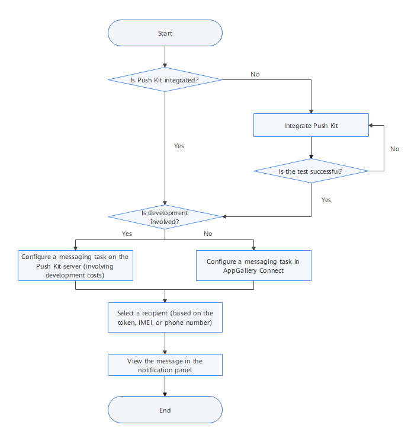
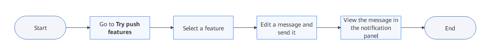
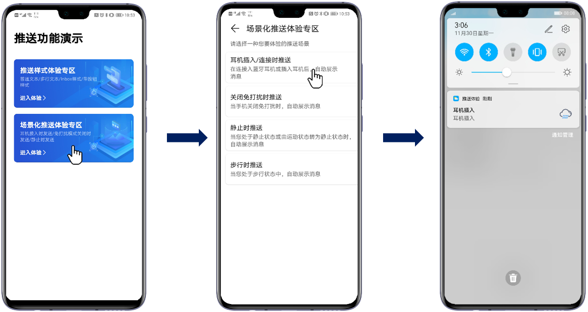

# HwPush App

<table><thead align="left"><tr id="row174707122410"><th class="cellrowborder" valign="top" width="17.261726172617262%" id="mcps1.1.4.1.1">
App Name

</th>
<th class="cellrowborder" valign="top" width="19.36193619361936%" id="mcps1.1.4.1.2">
How to Download

</th>
<th class="cellrowborder" valign="top" width="63.37633763376338%" id="mcps1.1.4.1.3">
Description

</th>
</tr>
</thead>
<tbody><tr id="row16470719245"><td class="cellrowborder" valign="top" width="17.261726172617262%" headers="mcps1.1.4.1.1 ">
HwPush App

</td>
<td class="cellrowborder" valign="top" width="19.36193619361936%" headers="mcps1.1.4.1.2 ">

<a href="https://h5hosting-drcn.dbankcdn.cn/cch5/AIBussiness-MLKit/pushcn/app-release.apk" target="_blank" rel="noopener noreferrer">Click here</a>

</td>
<td class="cellrowborder" valign="top" width="63.37633763376338%" headers="mcps1.1.4.1.3 "><ul id="ul1576116934612"><li>The app can be used only on Huawei phones.</li><li>Use the phone to scan the QR code on the left to download it.</li><li>Phones running EMUI 9.0 do not support the <strong id="b13327287349">Button</strong> style. For a better experience, it is recommended that you use phones running EMUI 10.0 or later.</li></ul>
</td>
</tr>
</tbody>
</table>

The app allows you to experience the following features:

-   **Message styles**

    Multiple message styles are supported, for example, the large text, inbox, and button.

-   **Scenario-based messaging**

    Messages can be pushed in multiple scenarios, for example, when headsets are inserted or connected, when the DND mode is disabled, when the user stays static, or when the user is walking.

To experience the push features or entire push process, you, as the app operations personnel, need to integrate Push Kit into your app, create a message on the console, and send it to the phone, as shown in the following figure.

The procedure is time-consuming and requires code compilation. Therefore, HUAWEI Push Kit provides the HwPush app for you to easily experience the push features through simple interaction, as shown in the following figure.

-   The procedure for sending a  **scenario-based message**  is as follows:

Start the app, go to  **Try push features**, select  **Scenario-based messaging**, select  **Headset inserted**, and insert the headset into your phone. You will receive a push message in the notification panel, as shown in the following figure.

So far, you have experienced this feature.

In the future, Push Kit will be improved based on developer requirements and mobile user experience, enriching product capabilities and providing better services. While, Huawei hopes that business personnel can skillfully use the push features based on their own business scenarios to achieve business growth.

