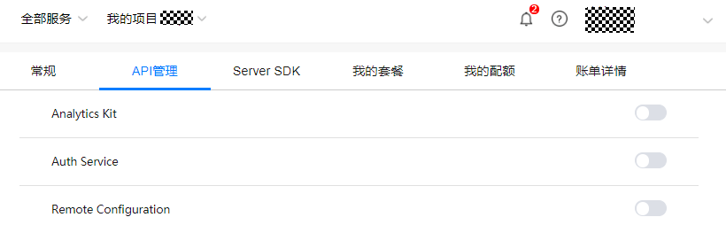
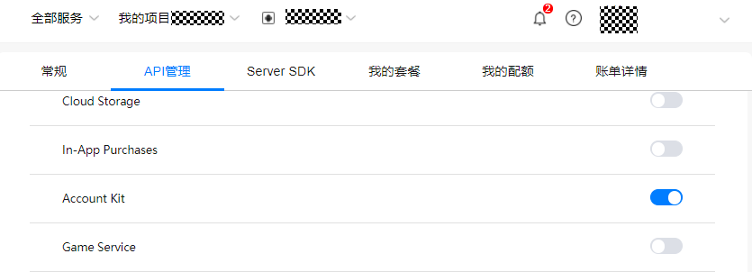

# 开通帐号服务

Duration: 1:00

1.  在[华为开发者联盟AppGallery Connect](https://developer.huawei.com/consumer/cn/service/josp/agc/index.html)中选择“我的项目”，在项目列表中选择创建的应用，在“项目设置”页面中选择“API管理”。

    

2.  打开“Account Kit”服务开关。

    

至此，已经为创建的应用开通了“帐号”服务。

