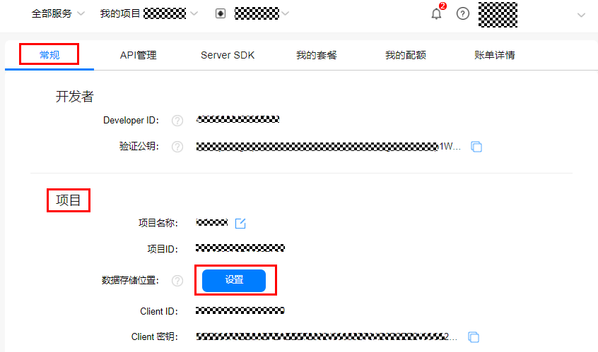
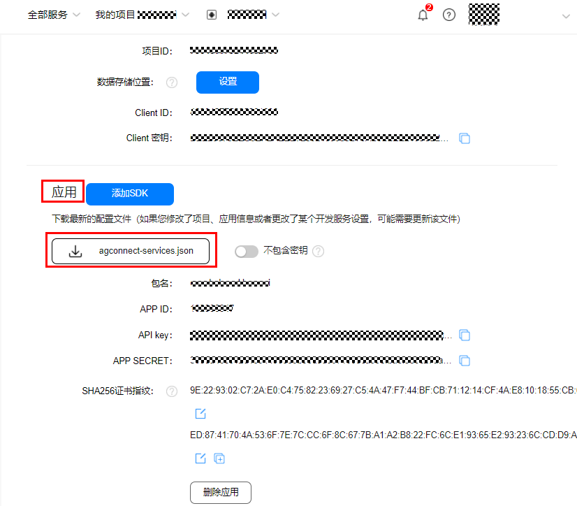
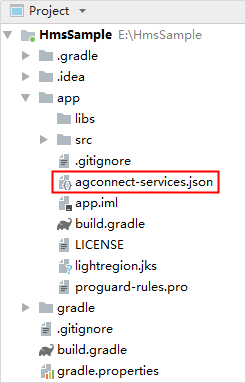
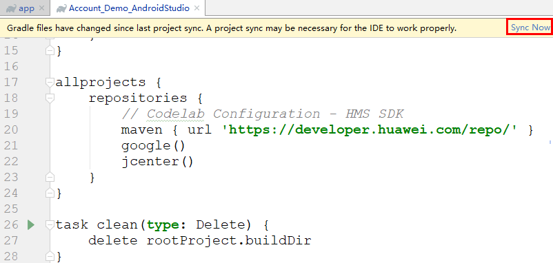

# 集成HMS Core SDK<a name="ZH-CN_TOPIC_0000001145522153"></a>

-   [获取配置文件](#section1483981214316)
-   [配置HMS Core SDK依赖](#section1253921234718)
-   [配置HMS Core SDK的Maven仓地址](#section44306423617)
-   [配置混淆脚本](#section159071285478)
-   [添加权限](#section1713517216319)

Duration: 5:00

## 获取配置文件<a name="section1483981214316"></a>

1.  打开[华为开发者联盟AppGallery Connect](https://developer.huawei.com/consumer/cn/service/josp/agc/index.html)应用管理中之前创建的应用，并选择“**开发-\>常规**”，点击数据存储位置设置按钮。

    

2.  下载应用中的“**agconnect-services.json**”。

    

3.  将 “agconnect-services.json”文件移至Android Studio开发工程应用模块的根目录。

    


## 配置HMS Core SDK依赖<a name="section1253921234718"></a>

1.  打开应用级的**build.gradle**文件。

    

2.  在“**dependencies**”中添加如下编译依赖，其中\{version\}替换为HMS Core SDK的版本号，例如：5.2.0.300。

    ```
    dependencies {
        implementation 'com.huawei.hms:hwid:{version}'
    }
    ```

    > **注意：** 
    >Codelab中依赖的版本号不一定是最新版本号，如果需要依赖最新版本请参见[版本更新说明](https://developer.huawei.com/consumer/cn/doc/development/HMSCore-Guides/version-change-history-0000001050048874)，修改依赖版本号即可，如：
    >implementation ‘com.huawei.hms:hwid:x.x.x.xxx'。

3.  点击Sync Now 同步工程。

    


## 配置HMS Core SDK的Maven仓地址<a name="section44306423617"></a>

1.  打开Android Studio项目级“build.gradle“文件。

    

2.  添加HUAWEI agcp插件以及Maven代码库。

    -   在“buildscript  \>  repositories“中配置HMS Core SDK的Maven仓地址。
    -   在“allprojects  \>  repositories“中配置HMS Core SDK的Maven仓地址。
    -   如果App中添加了“agconnect-services.json“文件则需要在“buildscript  \>  dependencies“中增加agcp配置。

    ```
    buildscript {
        repositories {
            google()
            jcenter()
            // 配置HMS Core SDK的Maven仓地址。
            maven {url 'https://developer.huawei.com/repo/'}
        }
        dependencies {
            ...
            // 增加agcp配置。
            classpath 'com.huawei.agconnect:agcp:1.4.2.300'
        }
    }
    
    allprojects {
        repositories {
            google()
            jcenter()
            // 配置HMS Core SDK的Maven仓地址。
            maven {url 'https://developer.huawei.com/repo/'}
        }
    } 
    ```

    > **说明：** 
    >Maven仓地址无法直接在浏览器中打开访问，只能在IDE中配置。如需添加多个Maven代码库，请将华为公司的Maven仓地址配置在最后。


## 配置混淆脚本<a name="section159071285478"></a>

> **说明：** 
>如果您有使用到代码混淆功能，请配置混淆配置文件避免HMS Core SDK被混淆导致功能异常。

1.  打开Android Studio工程的混淆配置文件**proguard-rules.pro**。
2.  加入混淆配置。

    ```
    -ignorewarnings
    -keepattributes *Annotation*
    -keepattributes Exceptions
    -keepattributes InnerClasses
    -keepattributes Signature
    -keepattributes SourceFile,LineNumberTable
    -keep class com.huawei.hianalytics.**{*;}
    -keep class com.huawei.updatesdk.**{*;}
    -keep class com.huawei.hms.**{*;}
    ```

3.  如果您使用了AndResGuard，需要在混淆配置文件中加入AndResGuard允许清单。

    ```
    "R.string.hms*",
    "R.string.connect_server_fail_prompt_toast",
    "R.string.getting_message_fail_prompt_toast",
    "R.string.no_available_network_prompt_toast",
    "R.string.third_app_*",
    "R.string.upsdk_*",
    "R.layout.hms*",
    "R.layout.upsdk_*",
    "R.drawable.upsdk*",
    "R.color.upsdk*",
    "R.dimen.upsdk*",
    "R.style.upsdk*",
    "R.string.agc*"
    ```


## 添加权限<a name="section1713517216319"></a>

Account SDK需要获取网络状态权限和获取Wi-Fi状态权限。需要在Manifest文件中添加下面权限：

```
<!--check network permissions-->
<uses-permission android:name="android.permission.ACCESS_NETWORK_STATE" />
<!--check wifi state-->
<uses-permission android:name="android.permission.ACCESS_WIFI_STATE" />
```

