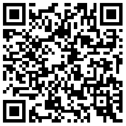
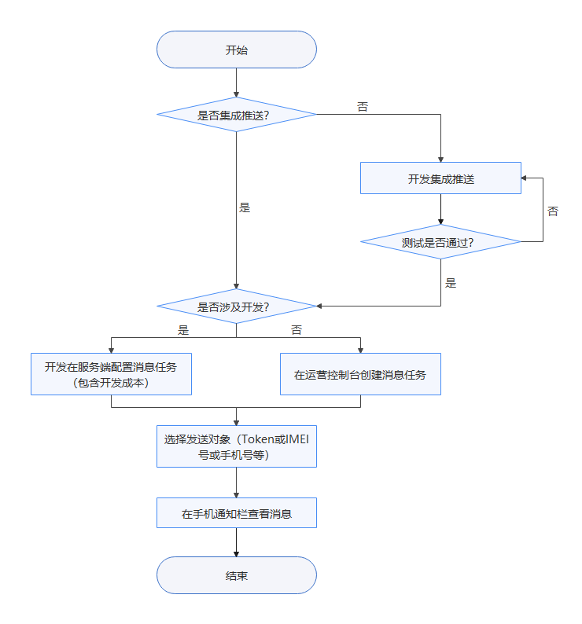
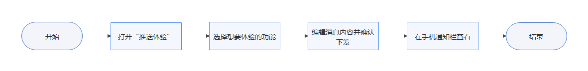
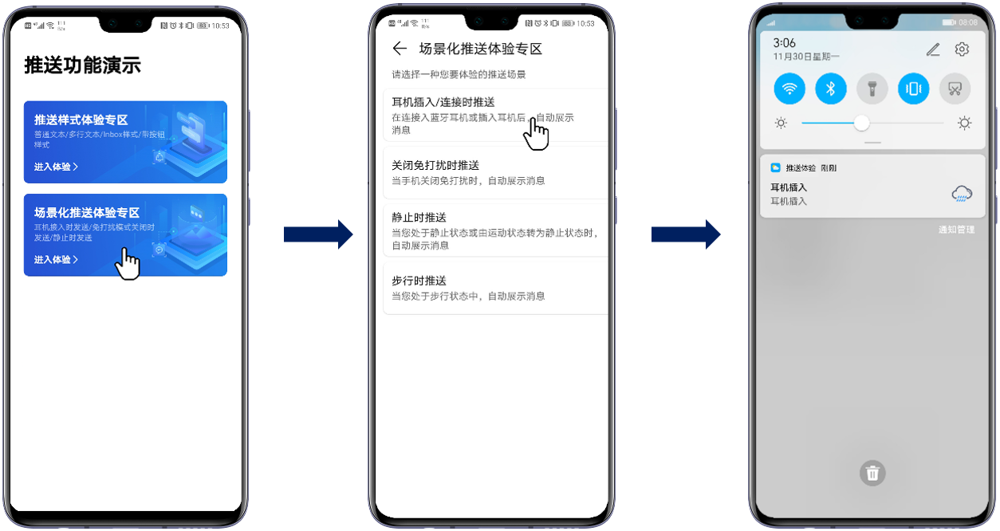

# 推送体验应用

<table><thead align="left"><tr id="row174707122410"><th class="cellrowborder" valign="top" width="17.261726172617262%" id="mcps1.1.4.1.1">
<strong id="b152491658162418">应用名称</strong>

</th>
<th class="cellrowborder" valign="top" width="19.36193619361936%" id="mcps1.1.4.1.2">
<strong id="b3546122192519">下载</strong>

</th>
<th class="cellrowborder" valign="top" width="63.37633763376338%" id="mcps1.1.4.1.3">
<strong id="b712467102517">说明</strong>

</th>
</tr>
</thead>
<tbody><tr id="row16470719245"><td class="cellrowborder" valign="top" width="17.261726172617262%" headers="mcps1.1.4.1.1 ">
推送体验

</td>
<td class="cellrowborder" valign="top" width="19.36193619361936%" headers="mcps1.1.4.1.2 ">

<a href="https://h5hosting-drcn.dbankcdn.cn/cch5/AIBussiness-MLKit/pushcn/app-release.apk" target="_blank" rel="noopener noreferrer">点击下载</a>

</td>
<td class="cellrowborder" valign="top" width="63.37633763376338%" headers="mcps1.1.4.1.3 "><ul id="ul1576116934612"><li>推送体验应用仅支持在华为手机上使用。</li><li>您可以使用手机浏览器扫描左侧二维码来下载推送体验应用。</li><li>EMUI 9的手机上不支持“带按钮样式推送”，为了更好地体验推送功能，建议您使用EMUI 10及之后的手机。</li></ul>
</td>
</tr>
</tbody>
</table>

华为推送体验应用提供两大体验专区：

-   推送样式体验专区

    支持多种消息推送样式，如：大文本样式、Inbox样式、按钮样式。

-   场景化推送体验专区

    支持多种场景推送，如：耳机插入/连接时推送，关闭免打扰模式时推送，静止时推送和步行时推送。

作为应用运营人员，如想要体验消息推送功能或推送的全过程，通常流程是先将产品接入消息推送，再从控制台创建消息任务并下发到手机，如下图所示。

由于该流程及步骤耗时较长且需要编写代码的工作量，为此华为推送服务提供了推送体验应用，通过简单的交互便可轻松体验华为推送的功能，流程如下图所示。

-   如何快速地体验或便捷、直观地演示“情景智能“的能力？

打开推送体验应用，选择“场景化推送体验专区”并点击体验场景“耳机插入/连接时推送”，此时，将耳机插入到手机中，在手机通知栏即可收到“推送体验”下发的一条推送消息，如下图所示。

至此，您已体验完基于“耳机插入/连接时推送”场景的“情景智能“功能。

未来，华为推送也将基于开发者需求和手机用户体验来提高产品的性能，丰富产品的能力，提供更好的服务。同时，我们也希望业务人员结合自身具体的业务场景，熟练应用华为推送的功能，实现业务的增长。

